## **RESEARCH ARTICLE**


# **Graphical calibration curves and the integrated calibration index (ICI) for survival models**

**Peter C. Austin1,2,[3](https://orcid.org/0000-0003-3337-233X) Frank E. Harrell Jr<sup>4</sup> David van Klaveren5,6**

- 2Institute of Health Policy, Management and Evaluation, University of Toronto, Toronto, Ontario, Canada
- 3Sunnybrook Research Institute, Toronto, Ontario, Canada
- 4Department of Biostatistics, Vanderbilt University School of Medicine, Nashville, Tennessee
- 5Department of Public Health, Erasmus MC, Rotterdam, The Netherlands
- 6Predictive Analytics and Comparative Effectiveness Center, Institute for Clinical Research and Health Policy Studies, Tufts Medical Center, Boston, Massachusetts

## **Correspondence**

Peter Austin, ICES G106, 2075 Bayview Avenue, Toronto, ON M4N 3M5, Canada. Email: peter.austin@ices.on.ca

## **Funding information**

Canadian Institutes of Health Research, Grant/Award Numbers: CRT43823, CTP79847, MOP 86508; Heart and Stroke Foundation of Canada; National Center for Advancing Translational Sciences, Grant/Award Number: UL1 TR002243; Patient-Centered Outcomes Research Institute, Grant/Award Number: ME-1606-35555; Ontario Ministry of Health and Long-Term Care; ICES

# **Abstract**

In the context of survival analysis, calibration refers to the agreement between predicted probabilities and observed event rates or frequencies of the outcome within a given duration of time. We aimed to describe and evaluate methods for graphically assessing the calibration of survival models. We focus on hazard regression models and restricted cubic splines in conjunction with a Cox proportional hazards model. We also describe modifications of the Integrated Calibration Index, of E50 and of E90. In this context, this is the average (respectively, median or 90th percentile) absolute difference between predicted survival probabilities and smoothed survival frequencies. We conducted a series of Monte Carlo simulations to evaluate the performance of these calibration measures when the underlying model has been correctly specified and under different types of model mis-specification. We illustrate the utility of calibration curves and the three calibration metrics by using them to compare the calibration of a Cox proportional hazards regression model with that of a random survival forest for predicting mortality in patients hospitalized with heart failure. Under a correctly specified regression model, differences between the two methods for constructing calibration curves were minimal, although the performance of the method based on restricted cubic splines tended to be slightly better. In contrast, under a mis-specified model, the smoothed calibration curved constructed using hazard regression tended to be closer to the true calibration curve. The use of calibration curves and of these numeric calibration metrics permits for a comprehensive comparison of the calibration of competing survival models.

## **KEYWORDS**

calibration, model validation, random forests, survival analysis, time-to-event model

# **1 INTRODUCTION**

Assessing calibration is an important component of deriving and validating clinical prediction models. Calibration refers to the agreement between predicted and observed risk.1,2 Time-to-event outcomes are common in prognostic research. Common examples include time to death or time to disease occurrence. While methods for evaluating the calibration of prediction models for binary outcomes (eg, logistic regression models) have been well-described,1-4 there is less

This is an open access article under the terms of the [Creative Commons Attribution-NonCommercial-NoDerivs](http://creativecommons.org/licenses/by-nc-nd/4.0/) License, which permits use and distribution in any medium, provided the original work is properly cited, the use is non-commercial and no modifications or adaptations are made. © 2020 The Authors. *Statistics in Medicine* published by John Wiley & Sons, Ltd.

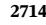

<sup>1</sup>ICES, Toronto, Ontario, Canada

information on methods to assess the calibration of models for time-to-event outcomes. When outcomes are time-to-event in nature, the objective of prognostic models is frequently focused on estimating the probability of the occurrence of the outcome within a specified duration of time. A classic example is one of the Framingham Risk Scores which uses a survival model to estimate the probability of developing coronary heart disease within 10 years.<sup>5</sup> When discussing the calibration of models for time-to-event outcomes we are referring to assessing the agreement between the observed and the estimated probability of the event occurring within a specified duration of time. Thus, calibration in this setting is assessing observed and predicted probabilities at specific points in time. Thus, in the context of the Framingham Risk Score, calibration would refer to comparing the observed and predicted probabilities of developing coronary heart disease within 10 years.

The objective of this article is to describe and evaluate the performance of methods for assessing the calibration of predicted probabilities derived from models for time-to-event outcomes. The article is structured as follows: In Section 2, we summarize common methods for assessing calibration for binary outcomes and describe extensions to assessing calibration of predicted probabilities derived from models for time-to-event outcomes. In Section 3, we describe methods to compute smoothed calibration curves for time-to-event models. We describe two methods, one based on a flexible adaptive hazard regression model and the other based on the use of restricted cubic splines with a Cox proportional hazards model. We also describe how to compute numeric metrics for summarizing calibration. In Section 4, we describe a series of Monte Carlo simulations to evaluate the performance of these methods. In Section 5, we report the results of these simulations. In Section 6, we present a case study illustrating the application of these methods when comparing the calibration of a Cox proportional hazards model for predicting mortality after hospitalization for heart failure with that of a random survival forest. Finally, in Section 7, we summarize our findings and place them in the context of the literature.

# **2 METHODS FOR ASSESSING CALIBRATION FOR BINARY EVENTS AND EXTENSIONS TO SURVIVAL ANALYSIS**

## **2.1 Calibration for binary events**

When outcomes are binary, calibration refers to the agreement between observed and estimated probabilities of the occurrence of the event or outcome. A variety of methods have been proposed to assess calibration in this setting. First, subjects can be divided into strata based on the predicted probability of the outcome (eg, dividing subjects into 10 equally sized groups using the deciles of the predicted probabilities). Then, within each stratum, the mean predicted probability is computed as is the empirically estimated probability of the outcome (ie, the crude estimated probability of the outcome amongst all subjects in the given stratum). The mean predicted probability of the outcome can then be compared with the empirically estimated probability of the outcome across strata. These can be compared graphically, with deviations from a diagonal line indicating lack of calibration. While this approach is simple to implement, a limitation is the potential loss of information resulting from binning subjects into strata based on predicted risk. Second, rather than dividing subjects into strata based on the predicted probability of the outcome, smooth calibration curves based on loess regression smoothers or flexible nonlinear models can be produced.1-3 This approach allows for an assessment of the agreement between observed and predicted risk across the spectrum of predicted risk. Third, summary numeric measures of calibration, such as the Integrated Calibration Index (ICI), E50, E90, and *E*max can be reported.1,6 The ICI is the weighted difference between smoothed observed proportions and predicted probabilities, in which observations are weighted by the empirical density function of the predicted probabilities. The ICI is equivalent to the mean difference between predicted probabilities and observed probabilities derived from a smoothed calibration curve. E50 and E90 denote the median and 90th percentile of the absolute difference between observed and predicted probabilities. *E*max denotes the maximum absolute difference between observed and predicted probabilities of the outcome.

## **2.2 Extensions to survival outcomes**

When outcomes are time-to-event in nature, calibration refers to the agreement between observed and estimated probabilities of the occurrence of the event or outcome within specified durations of time. Assessing calibration of predicted probabilities derived from models for time-to-event outcomes is complicated by two issues. First, calibration is

IN ET AL.
occur-
oration
not the
modi-
ed into
mean
served
to the
possi-
tion of
n lead
adaptive
een the
ves for
icle on
ority of
hazard
, and a
ods for
models.8
rocated
however,
nate of
e base-
e these
S

typically assessed for time-to-event outcomes by comparing observed vs predicted probabilities of the outcome occurring within a specified time *t*. Thus, if multiple time points are of interest clinically, one would need to assess calibration at each of these time points. Second, when assessing calibration at time *t*, one observes for a given subject, not the probability of the outcome, but a time-to-event outcome. The most commonly used approach appears to be a modification of the stratification-based approach described above for use with binary outcomes.1 Subjects are divided into strata based on the predicted probability of the occurrence of the event by time *t*. Within each stratum, the mean predicted probability of the occurrence of the event by time *t* is computed. Then, within each stratum, the observed probability of the occurrence of the event by time *t* is computed by fitting a Kaplan-Meier survival function to the subjects in that stratum. The mean predicted and observed probabilities can then be compared across strata, possibly using a scatter plot and superimposing a diagonal line on the resultant plot. Harrell suggests that a limitation of this approach is that, in addition to the risk categories being arbitrary, the categorization of predicted risk can lead to a loss of precision.1(p506) He suggested that smoothed calibration curves be constructed using the flexible adaptive hazard regression model described by Kooperberg.7 This approach allows for estimating the relationship between the observed outcome and predicted survival probabilities, which permit construction of smoothed calibration curves for time-to-event outcomes without assuming a parametric form or proportional hazards. While Kooperberg's article on hazard regression has been cited 178 times as of September 18, 2019 (Source: Web of Science), the large majority of these citations were by articles in the statistical and methodological literature. There is little evidence that hazard regression-based methods are commonly used to assess the calibration of time-to-event models. This approach, and a related-approach, will be described in greater detail in the following section. Crowson described a set of methods for assessing the calibration of Cox proportional hazards regression models based on fitting Poisson regression models.<sup>8</sup> Modifications of these methods allow for the production of smoothed calibration curves, similar to those advocated by Harrell.

The use of the Cox proportional hazards regression model is ubiquitous in modern medical research.<sup>9</sup> However, unlike parametric accelerated failure time models, the Cox regression model does not directly provide an estimate of the probability of the occurrence of the event within a specified duration of time. Obtaining an estimate of the baseline cumulative hazard function (eg, using the Breslow or Nelson-Aalen estimator) allows the analyst to estimate these probabilities.10

# **3 GRAPHICAL CALIBRATION CURVES AND CALIBRATION METRICS FOR SURVIVAL OUTCOMES**

In this section we describe methods for constructing smoothed calibration plots for survival outcomes and how numerical calibration metrics can be derived from these smoothed calibration curves.

## **3.1 Graphical calibration curves**

Let *F*(*t*0| **X**) denote a model for estimating the probability of the occurrence of an event prior to time *t*<sup>0</sup> for a subject with covariate vector **X**. *F*(*t*0| **X**) could be a commonly used method such as a Cox proportional hazard regression model or it could be a method from the machine learning literature, such as a random survival forest.11 For each subject, let *<sup>P</sup>̂<sup>t</sup>*<sup>0</sup> <sup>=</sup> *<sup>F</sup>*(*t*<sup>0</sup>|**X**) denote the predicted probability of the occurrence of the outcome prior to time *t*0.

Kooperberg et al described a family of flexible adaptive hazard regression models that use linear splines and tensor products to estimate the logarithm of the conditional hazard function.<sup>7</sup> This family of hazard regression models contains the proportional hazards models as a subclass. Hazard regression can be used to estimate a calibration curve for time-to-event outcomes. Given the observed time-to-event outcome for each subject (*T*), one can fit a hazard regression model: log(*h*(*t*)) = *<sup>g</sup>*(log(−log(<sup>1</sup> <sup>−</sup> *<sup>P</sup>̂<sup>t</sup>*<sup>0</sup> ))*, <sup>t</sup>*), in which the log-hazard of the outcome is modeled as a function of the complementary log-log transformation of the predicted probability of the outcome occurring prior to time *t*<sup>0</sup> (this predicted probability was obtained using the model fit in the previous paragraph, whose calibration one now wants to assess). Note that we use *<sup>P</sup>̂<sup>t</sup>*<sup>0</sup> in the preceding function, to highlight that calibration is being assessed at time *<sup>t</sup>*0, with *<sup>P</sup>̂<sup>t</sup>*<sup>0</sup> denoting the predicted probability of an event occurring prior to time *t*0. Based on the fitted hazard model, an estimated probability of the occurrence of the outcome prior to time *<sup>t</sup>*<sup>0</sup> conditional on *<sup>P</sup>̂<sup>t</sup>*<sup>0</sup> can be obtained. Note that while the model regressed the hazard of the outcome on the complementary log-log transformation of the predicted probability, we report results on the probability scale for greater interpretability. For each observed value of  $\hat{P}_{t_0}$ , the estimated probability of the occurrence of the outcome occurring prior to time  $t_0$  is obtained. These are displayed graphically to produce a calibration plot for time  $t_0$ .

An alternative to the use of a flexible adaptive hazard regression model is to use a conventional Cox proportional hazards model with restricted cubic splines to model the relationship between  $\log(-\log(1-\hat{P}_{t_0}))$  and the log-hazard of the outcome. Based on the fitted model, an estimated probability of the occurrence of the outcome prior to time  $t_0$  can be estimated for each value of  $\hat{P}_{t_0}$ . From these estimated probabilities, a calibration curve can be constructed. While this second approach can be implemented easily using standard statistical software, a disadvantage is having to assume proportional hazards.

Note that in both approaches we have used the complementary log-log transformation for the predicted probabilities rather than the probabilities themselves. In the experience of one of the authors, there are two advantages to this approach. First, this transformation likely lessens the number of knots needed when using restricted cubic splines. Second, it may increase the likelihood of a linear relationship between the probability of the outcome and the linear predictor. The simplification of the fit is a result of not needing to impose any constraints in the regression space.

Software for implementing both methods using the R statistical programming language is provided in Appendices A and B.

## 3.2 | Numerical metrics for calibration

Once a smoothed calibration curve has been constructed, one can compute the following numerical calibration metrics: ICI, E50, and E90. For each subject we have a predicted probability of the outcome occurring within time t. Then, using the smoothed calibration curve, one can determine an estimate of the smoothed observed probability of the outcome occurring within time t. The ICI is computed as the mean absolute difference between observed and predicted probabilities across the sample. This is equivalent to the weighted absolute difference between the calibration curve and the diagonal line of best fit, where the difference is weighted by the distribution of predicted probabilities.  $^6$  E50 is the median absolute difference between observed and predicted probabilities, while E90 is the 90th percentile of the absolute difference between observed and predicted probabilities. Let  $\hat{P}_{t_0}$  denote the predicted probability of the occurrence of the outcome prior to time  $t_0$  and let  $\hat{P}^c_{t_0}$  denote the smoothed or predicted probability based on the smoothed calibration curve (the latter is an estimate of the observed probability of the outcome that corresponds to the given predicted probability). The ICI =  $\frac{1}{N}\sum |\hat{P}^c_{t_0}-\hat{P}_{t_0}|$ , while E50 is the median of  $|\hat{P}^c_{t_0}-\hat{P}_{t_0}|$  across the sample and E90 is the 90th percentile of  $|\hat{P}^c_{t_0}-\hat{P}_{t_0}|$  across the sample.

# 4 | MONTE CARLO SIMULATIONS: METHODS

We conducted a series of Monte Carlo simulations to examine the ability of the methods described above to assess the calibration of survival models. We examined three different scenarios: (i) the fitted model was correctly specified; (ii) the fitted model omitted a quadratic term; (iii) the fitted model omitted an interaction. Our first set of simulations examined the choice of number of knots when using restricted cubic splines to construct a calibration curve.

## 4.1 Choice of number of knots for the restricted cubic spline model

The number of knots used in the restricted cubic splines when modeling the relationship between the hazard of the outcome and the predicted probability of the outcome within a given duration of time can be thought of as a hyper-parameter. We conducted a series of simulations to determine the optimal value of this hyper-parameter when the underlying regression model was correctly specified.

We simulated data for a large super-population consisting of 1 000 000 subjects. For each subject we simulated a continuous covariate x from a standard normal distribution:  $x \sim N(0, 1)$ . While frequently the focus will be on assessing the

calibration of a multivariable model, one can think of the single continuous covariate as a linear predictor or risk score that summarizes the multivariable contribution of a set of predictor variables. We then simulated a time-to-event outcome for each subject so that outcomes followed a Cox-Weibull model, using methods described by Bender et al.12 We simulated event times as follows: *T* = ( <sup>−</sup>log(*U*) exp() )<sup>1</sup>∕ , where *U* is a random uniform number between 0 and 1, = log(1.5), = 0.0000227, and = 1.75. Thus, a one unit increase in *x* (equivalent to a one standard deviation (SD) increase) was associated with a 50% increase in the hazard of the outcome, the median event time was approximately 1 year in the super-population and the maximum observed event time was approximately 10 years. We determined the 10th, 25th, 50th, 75th, and 90th percentiles of event times in this large super-population. We refer to these times as *t*10, *t*25, *t*50, *t*75, and *t*90, respectively.

From the large super-population, we draw a random sample of size *N*. In this sample we used a Cox proportional hazards model to regress the hazard of the outcome on the single covariate *X*. The calibration of the fitted Cox model was assessed using restricted cubic splines with *k* knots, as described in the previous section. We evaluated the calibration of the fitted model at the five times: *t*10, *t*25, *t*50, *t*75, and *t*90. Graphical smoothed calibration curves, ICI, E50, and E90 were computed. This process was repeated 1000 times and the mean calibration curve was estimated across the 1000 simulation replicates (the values of each of the 1000 calibration curves were evaluated along the same grid; for each value on that grid, we determined the mean value across the 1000 calibration curves). Similarly, ICI, E50, and E90 were averaged across the 1000 simulation replicates. We allowed one factor to vary in these simulations: the number of knots. We considered three different values for this factor: 3, 4, and 5. The size of the random samples (*N*) was fixed at 1000 subjects.

## **4.2 Correctly specified model**

These simulations were similar to those described above with four exceptions. First, we used both restricted cubic splines and hazard regression to assess model calibration. Second, we fixed the number of knots for the restricted cubic spline model at three, based on the results from the previous set of simulations. Third, we allowed one factor to vary in this set of simulations: the size of the random samples. We considered three different values for this factor: 500, 1000, and 10 000. Fourth, we introduced the presence of censoring and allowed the proportion of subjects who were censored to vary across scenarios. We allowed the proportion of subjects that were censored to range from 0 to 0.60 in increments of 0.10.

In order to incorporate censoring, we modified the data-generating process so that for each subject we simulated an event time (using methods identical to those described above) and a censoring time. Censoring times were simulated from an exponential distribution. For each subject, the observed survival time was the minimum of the simulated event time and the simulated censoring time. Subjects were considered as censored observations if the censoring time was less than the event time. A bisection approach was used to determine the rate parameter for the exponential distribution so that the proportion of censored subjects in the super-population was equal to the desired value. Due to the presence of censoring, we evaluated calibration at the specified quantiles of the observed survival time in the large super-population, rather than at the specified quantiles of event times.

## **4.3 Model with quadratic relationship**

The simulations described above evaluated the performance of the graphical calibration methods when the survival model was correctly specified. This set of simulations was similar to those described in Section 4.2, with the following modifications. First, event times were simulated as follows:

$$T = \left(\frac{-\log(U)}{\lambda \exp(\beta_1 x + \beta_2 x^2)}\right)^{1/\nu},$$

where <sup>1</sup> = log(1.5) and <sup>2</sup> = log(1.25). Thus, the log-hazard of the outcome has a quadratic relationship with the continuous covariate *x*. In each random sample of size *N*, a mis-specified Cox proportional hazards model was fit. The model incorporated only a linear term for *x* and omitted the *x*<sup>2</sup> term. We did not incorporate censoring in this set of simulations for two reasons: (i) censoring was shown to have no effect in the previous set of simulations; (ii) to simplify the presentation of the results.

## **4.4 Model with interaction**

This set of simulations explored the use of graphical calibration methods when an interaction term was omitted from the fitted model. This set of simulations was similar to those described in Section 4.2, with the following modifications. First, two covariates were simulated for each subject. As above, the first covariate was simulated from a standard normal distribution: *x*1∼*N*(0, 1). However, the second covariate was simulated from a Bernoulli distribution with parameter 0.5: *x*2∼Be(0.5). Second, event times were simulated as follows: *T* = ( <sup>−</sup>log(*U*) exp(1*x*1+2*x*1*x*2) )<sup>1</sup>∕ , where <sup>1</sup> = log(1) = 0 and <sup>2</sup> = log(2)−log(1) = log(2). Thus, among subjects for whom *x*<sup>2</sup> = 0, there was no association between *x*<sup>1</sup> and the hazard of the outcome (hazard ratio = 1), while in subjects for whom *x*<sup>2</sup> = 1, a one unit increase in *x*<sup>1</sup> (equivalent to a one SD increase) was associated with a 100% increase in the hazard of the outcome (hazard ratio = 2). In each random sample of size *N*, a mis-specified Cox proportional hazards model was fit. The fitted model incorporated two variables: *x*<sup>1</sup> and *x*<sup>2</sup> and omitted the interaction between these two variables. As in the previous section, we did not incorporate censoring in this set of simulations for two reasons: (i) censoring was shown to have no effect in the simulations in Section 4.2; (ii) to simplify the presentation of the results.

## **4.5 Software**

The Cox regression models were fit using the coxph function in the survival package (version 2.44-1.1) for R (version 3.5.1). Calibration curves using hazards regression were estimated using the hare and phare functions in the polspline package (version 1.1.15) for R. Restricted cubic splines were implemented using the rcs function from the rms package (version 5.1-2) for R. Note that the calibrate.\* functions in the rms package make this automatic.

# **5 MONTE CARLO SIMULATIONS: RESULTS**

## **5.1 Number of knots for the restricted cubic spline model**

The mean estimated calibration curves across the 1000 simulation replicates are described in Figure 1. The figure consists of five panels, one for each of the five times points at which calibration was assessed (*t*10, *t*25, *t*50, *t*75, and *t*90). Each panel displays the mean calibration curve for each of the three values of the number of knots (3, 4, and 5 knots). For each value on the grid of predicted probabilities along which the mean calibration curve was estimated (see above), we also estimated the 2.5th and 97.5th percentiles of the observed probabilities across the 1000 sampled datasets. Using these estimated percentiles, we have superimposed lines for each of the three values of the number of knots reflecting the variability in the estimated calibration curve across the 1000 simulation replicates. On each panel we have also superimposed a non-parametric estimate of the density function of the predicted probabilities in the large super-population (right vertical axis). Across the five times at which we assessed calibration, the use of three knots tended to result in calibration curves that were closer to the diagonal line of perfect calibration. For each of the five times, the use of three knots resulted in calibration curves that were, on average, indistinguishable from the line of perfect calibration. Furthermore, the estimated calibration curves displayed increasing variability across simulation replicates as the number of knots increased from three to five.

The mean estimated values of the ICI, E50, and E90, along with their SD across the 1000 simulated samples are reported in Figure 2 (the standard errors of the different calibration metrics are reported as error bars). For all combinations of time points (*t*10, *t*25, *t*50, *t*75, and *t*90) and metrics (ICI, E50, and E90), mean calibration was better when three knots were used than when four or five knots were used. ICI was closer to zero when using three knots compared to when using four knots in at least 77% of the simulated datasets across the five different percentiles of event time. ICI was closer to zero when using three knots compared to when using five knots in at least 89% of the simulated datasets across the

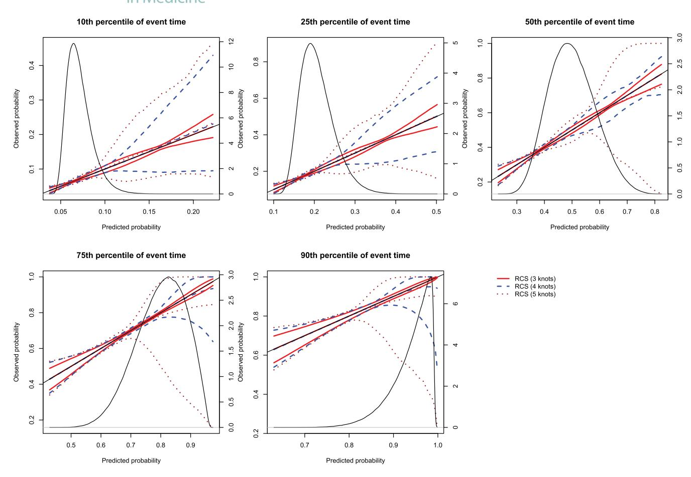

**FIGURE 1** Calibration plots when using restricted cubic splines (RCS) and different number of knots. For each of the three different values of number of knots (3, 4, or 5), or there are three curves. The inner curve represents the mean calibration curve across the 1000 simulation replicates. The outer two curves represent the 2.5th and 97.5th percentiles of the calibration curves across the simulation replicates. The density function denotes a non-parametric estimate of the distribution of predicted risk across the large super-population (right axis) [Colour figure can be viewed at [wileyonlinelibrary.com\]](http://wileyonlinelibrary.com)

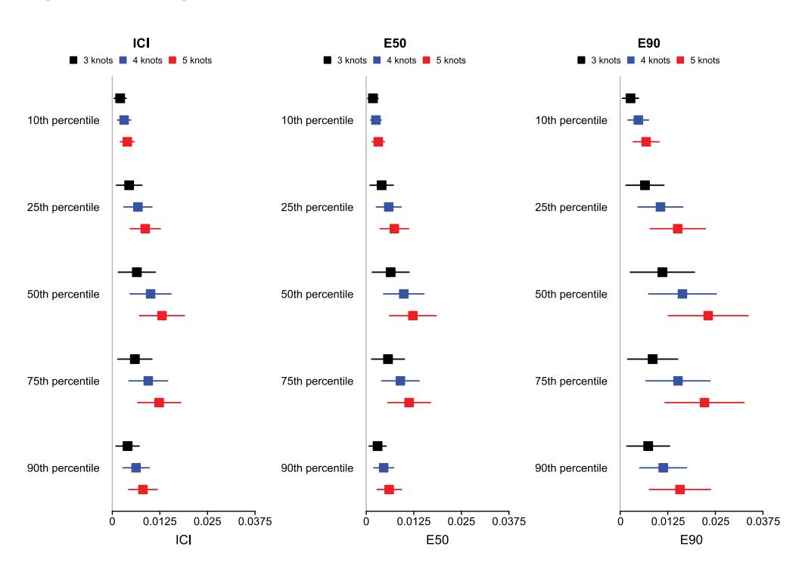

**FIGURE 2** ICI/E50/E90 when using RCS and different number of knots. The squares represent the mean value of ICI/E50/E90 across the 1000 simulation replicates. The error bars represent the SD of ICI/E50/E90 across the 1000 simulation replicates [Colour figure can be viewed at [wileyonlinelibrary.com\]](http://wileyonlinelibrary.com)

five different percentiles of event time. E50 was closer to zero when using three knots compared to when using four knots in at least 66% of the simulated datasets across the five different percentiles of event time. E50 was closer to zero when using three knots compared to when using five knots in at least 78% of the simulated datasets across the five different percentiles of event time. E90 was closer to zero when using three knots compared to when using four knots in at least 74% of the simulated datasets across the five different percentiles of event time. E90 was closer to zero when using three knots compared to when using five knots in at least 86% of the simulated datasets across the five different percentiles of event time.

Based on the results of these simulations, we concluded that the use of three knots is preferable to the use of four or five knots when using restricted cubic splines to compute calibration curves. Accordingly, this value was used in all subsequent simulations.

## **5.2 Correctly specified regression model**

The mean estimated calibration curves across the 1000 simulation replicates are described in Figures 3-8. There is one figure for combination of sample size (500/1000/10 000) and method of constructing calibration curves (restrictive cubic splines vs hazard regression). Due to the incorporation of different degrees of censoring, results from the different methods could not be superimposed on the same figure and retain their readability. Each calibration curve is restricted to a range of predicted probabilities ranging from the first to the 99th percentiles of risk in the population. Each figure consists of five panels, one for each of the five time points at which calibration was assessed (*t*10, *t*25, *t*50, *t*75, and *t*90). Each panel depicts the mean calibration curve for the given method of constructing calibration curves, along with lines denoting the 2.5th and 97.5th percentiles of the calibration curves across the 1000 simulation replicates. This pair of curves provides an assessment of the variability of the calibration curves across simulation replicates. There is one set of curves for each

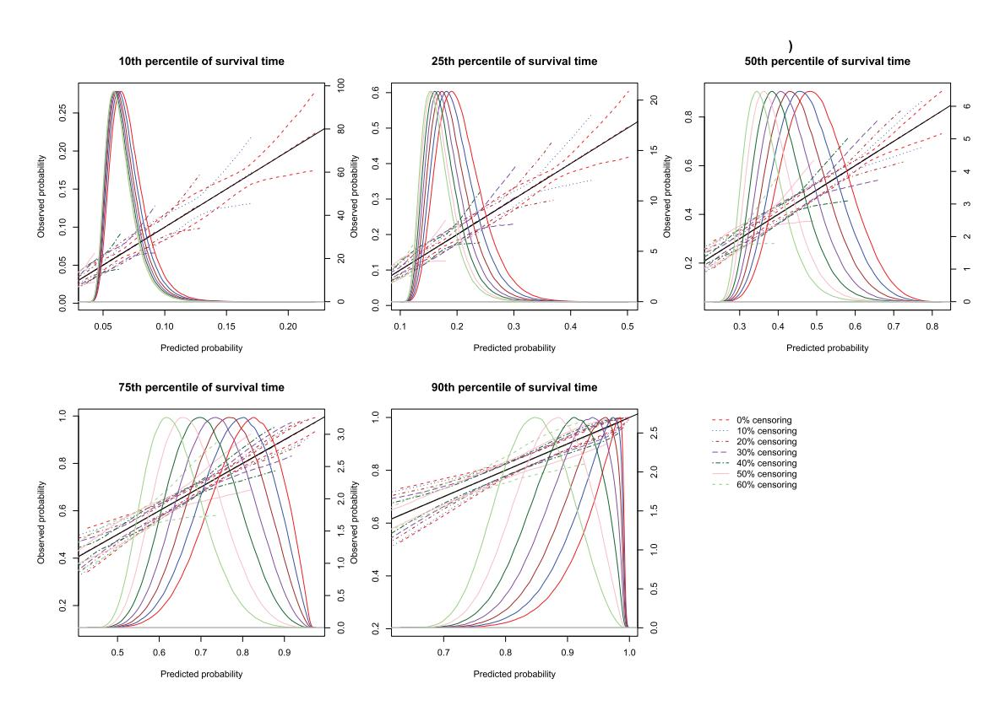

**FIGURE 3** Effect of degree of censoring on estimated calibration curves for different sample sizes and estimation methods. There are three curves for each of the seven degrees of censoring. The inner curve represents the mean calibration curve across the 1000 simulation replicates. The outer two curves represent the 2.5th and 97.5th percentiles of the calibration curves across the simulation replicates. The density function denotes a non-parametric estimate of the distribution of predicted risk across the large super-population (right axis) [Colour figure can be viewed at [wileyonlinelibrary.com\]](http://wileyonlinelibrary.com)

**FIGURE 4** Effect of degree of censoring on estimated calibration curves for different sample sizes and estimation methods. There are three curves for each of the seven degrees of censoring. The inner curve represents the mean calibration curve across the 1000 simulation replicates. The outer two curves represent the 2.5th and 97.5th percentiles of the calibration curves across the simulation replicates. The density function denotes a non-parametric estimate of the distribution of predicted risk across the large super-population (right axis) [Colour figure can be viewed at [wileyonlinelibrary.com\]](http://wileyonlinelibrary.com)

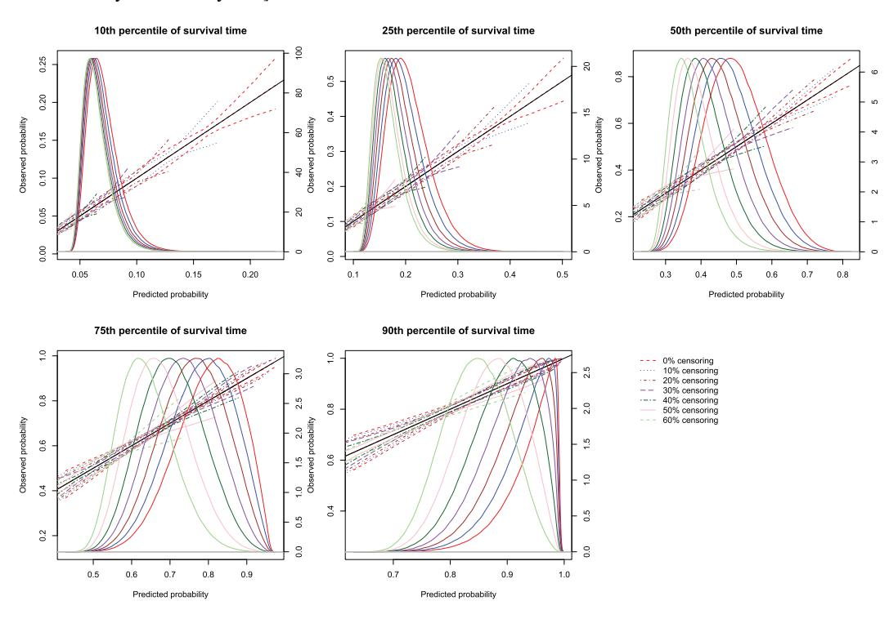

**FIGURE 5** Effect of degree of censoring on estimated calibration curves for different sample sizes and estimation methods. There are three curves for each of the seven degrees of censoring. The inner curve represents the mean calibration curve across the 1000 simulation replicates. The outer two curves represent the 2.5th and 97.5th percentiles of the calibration curves across the simulation replicates. The density function denotes a non-parametric estimate of the distribution of predicted risk across the large super-population (right axis) [Colour figure can be viewed at [wileyonlinelibrary.com\]](http://wileyonlinelibrary.com)

**FIGURE 6** Effect of degree of censoring on estimated calibration curves for different sample sizes and estimation methods. There are three curves for each of the seven degrees of censoring. The inner curve represents the mean calibration curve across the 1000 simulation replicates. The outer two curves represent the 2.5th and 97.5th percentiles of the calibration curves across the simulation replicates. The density function denotes a non-parametric estimate of the distribution of predicted risk across the large super-population (right axis) [Colour figure can be viewed at [wileyonlinelibrary.com\]](http://wileyonlinelibrary.com)

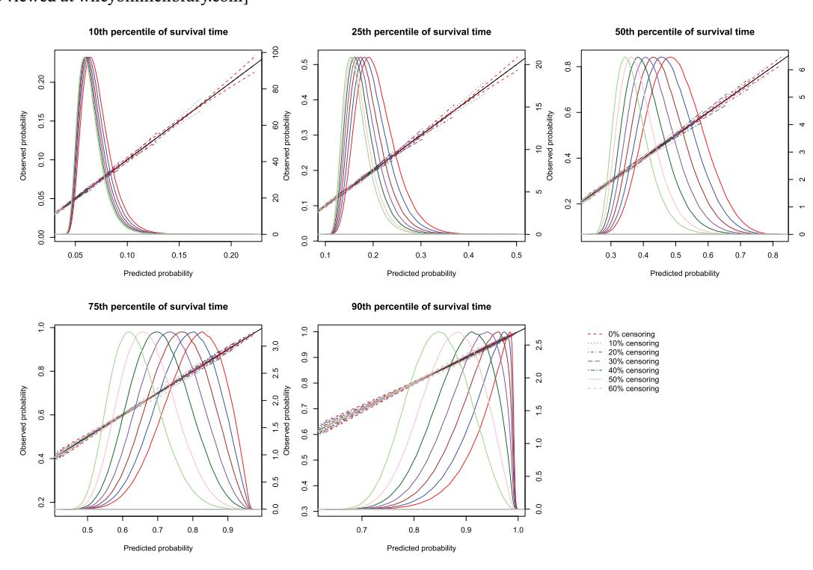

**FIGURE 7** Effect of degree of censoring on estimated calibration curves for different sample sizes and estimation methods. There are three curves for each of the seven degrees of censoring. The inner curve represents the mean calibration curve across the 1000 simulation replicates. The outer two curves represent the 2.5th and 97.5th percentiles of the calibration curves across the simulation replicates. The density function denotes a non-parametric estimate of the distribution of predicted risk across the large super-population (right axis) [Colour figure can be viewed at [wileyonlinelibrary.com\]](http://wileyonlinelibrary.com)

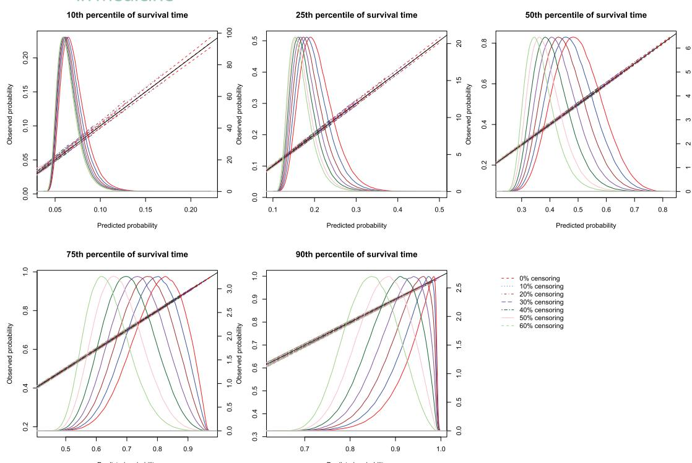

**FIGURE 8** Effect of degree of censoring on estimated calibration curves for different sample sizes and estimation methods. There are three curves for each of the seven degrees of censoring. The inner curve represents the mean calibration curve across the 1000 simulation replicates. The outer two curves represent the 2.5th and 97.5th percentiles of the calibration curves across the simulation replicates. The density function denotes a non-parametric estimate of the distribution of predicted risk across the large super-population (right axis) [Colour figure can be viewed at [wileyonlinelibrary.com\]](http://wileyonlinelibrary.com)

of the different degrees of censoring. On each panel we have superimposed a diagonal line denoting perfect calibration. On each panel we have also superimposed non-parametric estimates of the density of the predicted probabilities in the large super-population (right vertical axis). Note that there is a separate density function for each of the different degrees of censoring.

Regardless of the degree of censoring, both methods tended to result in calibration curves that were close to the diagonal line of perfect calibration over the range of predicted probabilities in which most subjects lay. When the sample size was low, both methods resulted in calibration curves that displayed moderate to large variability in the region in which predicted probabilities had low density. When the sample size was 500, differences between the two approaches were, at most, minor. However, the method based on restricted cubic splines always resulted in a mean calibration curve that coincided with the diagonal line denoting perfect calibration. When the sample size was 1000 or 10 000, then both methods produced calibration curves that were, on average, essentially indistinguishable from the diagonal line of perfect calibration. Furthermore, when the sample size was 10 000, there was very little variation in the estimated calibration curves across simulation replicates.

The mean estimated values of calibration metrics are reported in Figure 9 (ICI), Figure 10, (E50), and Figure 11 (E90). In each figure there are five panels, one for each of the times at which calibration is assessed. Since the fitted model was correctly specified, we want the values of the calibration metrics to be close to zero. For both methods (restricted cubic splines and hazard regression), ICI tended to be close to zero for most settings and times at which calibration was assessed. For each estimation method, ICI tended to decrease towards zero as the sample size increased. For a given sample size and degree of censoring, the use of restricted cubic splines tended to result in an estimated ICI that was closer to zero than did the use of hazard regression. For both methods (restricted cubic splines and hazard regression). When assessing calibration at a higher percentile of survival time (75th and 90th percentiles), the estimated ICI tended to increase as the proportion of subjects that were censored increased when restricted cubic splines were used. The converse was true for lower percentiles of survival time. Similar results were observed for E50 and E90.

**FIGURE 9** Relationship between degree of censoring and estimation of ICI. There is one line for each combination of sample size and estimation method. The points represent the mean ICI across the 1000 simulation replicates [Colour figure can be viewed at [wileyonlinelibrary.com\]](http://wileyonlinelibrary.com)

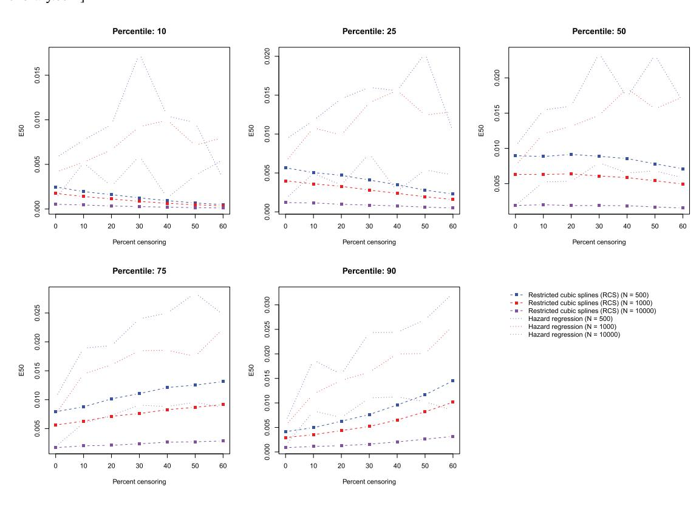

**F I G U R E 10** Relationship between degree of censoring and estimation of E50. There is one line for each combination of sample size and estimation method. The points represent the mean E50 across the 1000 simulation replicates [Colour figure can be viewed at [wileyonlinelibrary.com\]](http://wileyonlinelibrary.com)

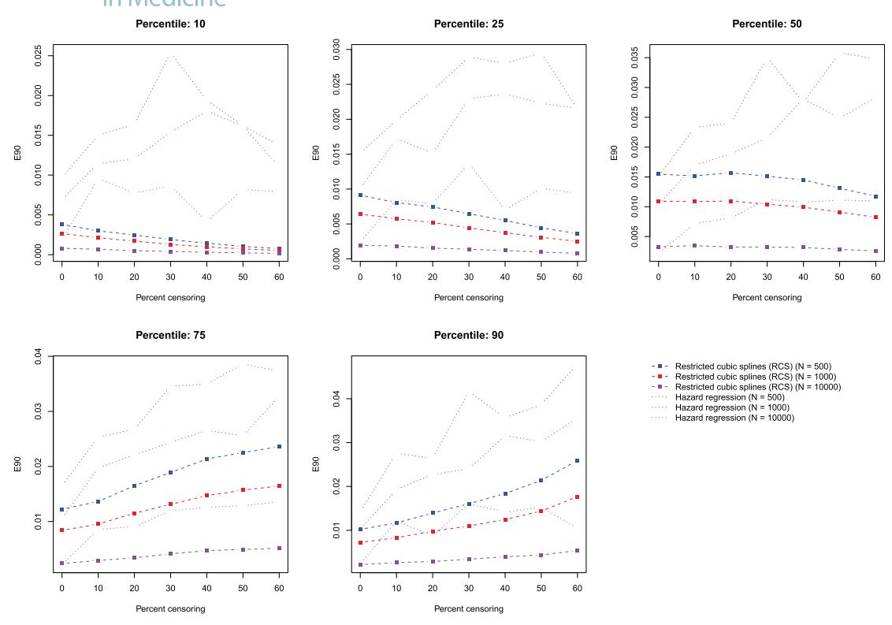

**F I G U R E 11** Relationship between degree of censoring and estimation of E90. There is one line for each combination of sample size and estimation method. The points represent the mean E90 across the 1000 simulation replicates [Colour figure can be viewed at [wileyonlinelibrary.com\]](http://wileyonlinelibrary.com)

## **5.3 Incorrectly specified regression model: omission of a quadratic term**

The mean estimated calibration curves across the 1000 simulation replicates are described in Figure 12 (sample size = 500), Figure 13 (sample sizes = 1000), and Figure 14 (sample size = 10 000). The figures have a similar structure to those of Figures 3-8, except that there are no calibration curves in the presence of censoring. In all three figures the mean calibration curves differed from the diagonal line of perfect calibration. The mean calibration curves tended to have an approximately quadratic shape, providing evidence that a quadratic term had been omitted from the model. The variation displayed by the calibration curves decreased with increasing sample size.

On each panel we have superimposed the true calibration curve (green curve) (which is defined differently from the diagonal line of perfect calibration). This curve was estimated using the large super-population. We applied the true (correctly specified) model and the mis-specified model to the super-population to estimate the true probability of the outcome and the mis-specified probability of the outcome for each subject in the super-population. We then plotted the true probability of the outcome against the mis-specified probability of the outcome using a solid green curve, to denote the true calibration curve. In general, the smoothed calibration curve estimated using hazard regression tended to be closer to the true calibration curve, compared with the calibration curve estimated using restricted cubic splines. When making predictions at the 10th, 25th, and 50th percentiles of event time, differences between the two approaches were minimal; however, the hazard regression-based approach tended to be slightly closer to the true calibration curve.

The mean estimated values of the ICI, E50, and E90 are reported in the top section of Table 1. Since a mis-specified model had been fit, we want the values of the calibration metrics to be different from zero, indicating that the models are miscalibrated. The values of the calibration metrics reported in Table 1 are larger than those reported when a correctly specified model was fit (Figures 9-11). For a given setting, the values of ICI, E50, and E90 obtained when using restricted cubic splines tended to be equal to or larger than those obtained when using hazard regression.

**F I G U R E 12** Calibration plots when the true model included a quadratic term (N = 500). There are three curves for each of the two estimation methods (RCS and hazard regression). The inner curve represents the mean calibration curve across the 1000 simulation replicates. The outer two curves represent the 2.5th and 97.5th percentiles of the calibration curves across the simulation replicates. The green curve denotes the true calibration curve derived from the large super-population. The density function denotes a non-parametric estimate of the distribution of predicted risk across the large super-population (right axis) [Colour figure can be viewed at [wileyonlinelibrary.com\]](http://wileyonlinelibrary.com)

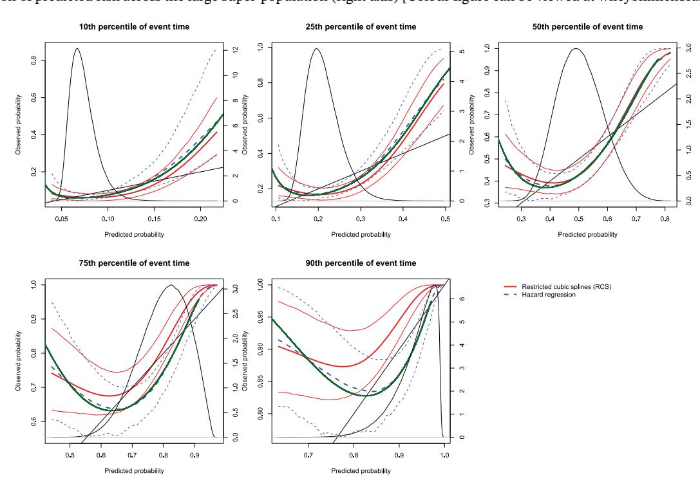

**F I G U R E 13** Calibration plots when the true model included a quadratic term (N = 1000). There are three curves for each of the two estimation methods (RCS and hazard regression). The inner curve represents the mean calibration curve across the 1000 simulation replicates. The outer two curves represent the 2.5th and 97.5th percentiles of the calibration curves across the simulation replicates. The green curve denotes the true calibration curve derived from the large super-population. The density function denotes a non-parametric estimate of the distribution of predicted risk across the large super-population (right axis) [Colour figure can be viewed at [wileyonlinelibrary.com\]](http://wileyonlinelibrary.com)

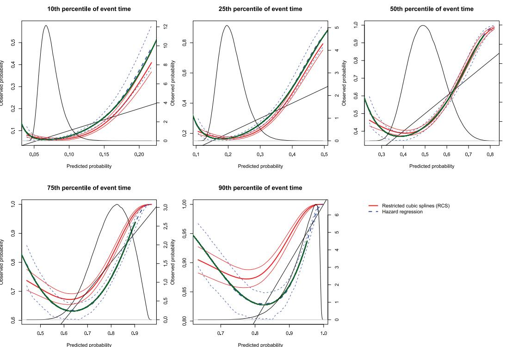

**F I G U R E 14** Calibration plots when the true model included a quadratic term(N = 10,000). There are three curves for each of the two estimation methods (RCS and hazard regression). The inner curve represents the mean calibration curve across the 1000 simulation replicates. The outer two curves represent the 2.5th and 97.5th percentiles of the calibration curves across the simulation replicates. The green curve denotes the true calibration curve derived from the large super-population. The density function denotes a non-parametric estimate of the distribution of predicted risk across the large super-population (right axis) [Colour figure can be viewed at [wileyonlinelibrary.com\]](http://wileyonlinelibrary.com)

The bottom section of Table 1 reports the ICI, E50, and E90 when comparing differences between predicted probabilities and the true calibration curve described above (note that since the true calibration curve is estimated in the full super-population, there are not separate values of the calibrations metrics for different sample sizes). Ideally, we want the estimated values of these metrics to be close to the true values. The values of ICI, E50, and E90 produced using hazard regression tended to be modestly closer to the "true" values of ICI, E50, and E90 than are the values produced using restricted cubic splines.

## **5.4 Incorrectly specified regression model: omission of an interaction term**

The mean estimated calibration curves across the 1000 simulation replicates are described in Figure 15 (sample size = 500), Figure 16 (sample sizes = 1000), and Figure 17 (sample size = 10 000). The figures have a similar structure to the previous sets of figures. These figures suggest that despite the omission of an interaction, the resultant models were, in general, well-calibrated. When assessing calibration at all five time points, both methods resulted in mean calibration curves that were close to the diagonal line that denotes perfect calibration in the range of predicted probabilities with the highest density.

On each panel we have superimposed the true calibration curve (green curve). The true calibration curve is different from the diagonal line denoting perfect calibration. When making predictions at the 90th percentiles of event time, the smoothed calibration curve estimated using hazard regression tended to be closer to the true calibration curve compared with the smoothed calibration curve estimated using restricted cubic splines. When making predictions at the 10th, 25th, 50th, and 75th percentiles of event time, neither approach resulted in smoothed calibration curves that coincided with the true calibration curve over its entire range. Furthermore, neither approach resulted in a smoothed calibration curve that was noticeably closer to the true calibration curve than that produced by the other method.

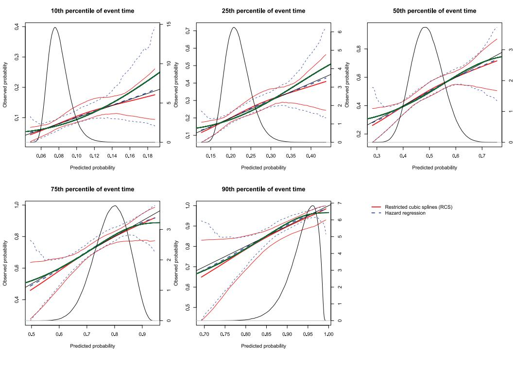

**F I G U R E 15** Calibration plots when the true model included an interaction term (N = 500). There are three curves for each of the two estimation methods (RCS and hazard regression). The inner curve represents the mean calibration curve across the 1000 simulation replicates. The outer two curves represent the 2.5th and 97.5th percentiles of the calibration curves across the simulation replicates. The green curve denotes the true calibration curve derived from the large super-population. The density function denotes a non-parametric estimate of the distribution of predicted risk across the large super-population (right axis) [Colour figure can be viewed at [wileyonlinelibrary.com\]](http://wileyonlinelibrary.com)

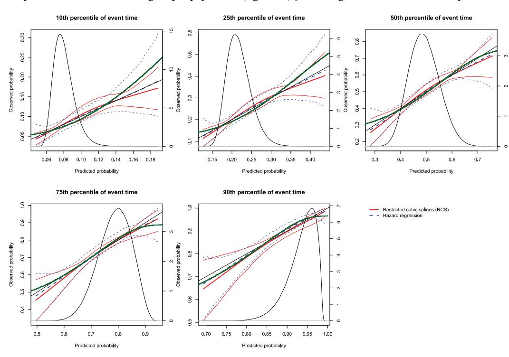

**F I G U R E 16** Calibration plots when the true model included an interaction term (N = 1000). There are three curves for each of the two estimation methods (RCS and hazard regression). The inner curve represents the mean calibration curve across the 1000 simulation replicates. The outer two curves represent the 2.5th and 97.5th percentiles of the calibration curves across the simulation replicates. The green curve denotes the true calibration curve derived from the large super-population. The density function denotes a non-parametric estimate of the distribution of predicted risk across the large super-population (right axis) [Colour figure can be viewed at [wileyonlinelibrary.com\]](http://wileyonlinelibrary.com)

**TABLE 1** ICI, E50, and E90 in simulations with model with a quadratic relationship

|             |                          | RCS   |       |       | Hazard regression |       |       |
|-------------|--------------------------|-------|-------|-------|-------------------|-------|-------|
| Sample size | Percentile of event time | ICI   | E50   | E90   | ICI               | E50   | E90   |
| 500         | 10                       | 0.026 | 0.021 | 0.036 | 0.027             | 0.020 | 0.039 |
| 500         | 25                       | 0.053 | 0.047 | 0.087 | 0.051             | 0.040 | 0.087 |
| 500         | 50                       | 0.071 | 0.071 | 0.129 | 0.068             | 0.061 | 0.122 |
| 500         | 75                       | 0.063 | 0.056 | 0.091 | 0.060             | 0.048 | 0.103 |
| 500         | 90                       | 0.042 | 0.031 | 0.080 | 0.039             | 0.023 | 0.077 |
| 1000        | 10                       | 0.026 | 0.021 | 0.035 | 0.027             | 0.020 | 0.036 |
| 1000        | 25                       | 0.052 | 0.047 | 0.087 | 0.050             | 0.039 | 0.085 |
| 1000        | 50                       | 0.071 | 0.071 | 0.130 | 0.067             | 0.060 | 0.123 |
| 1000        | 75                       | 0.063 | 0.055 | 0.090 | 0.059             | 0.048 | 0.096 |
| 1000        | 90                       | 0.042 | 0.031 | 0.079 | 0.038             | 0.023 | 0.072 |
| 10 000      | 10                       | 0.026 | 0.021 | 0.035 | 0.026             | 0.019 | 0.031 |
| 10 000      | 25                       | 0.052 | 0.047 | 0.086 | 0.050             | 0.040 | 0.076 |
| 10 000      | 50                       | 0.071 | 0.071 | 0.130 | 0.064             | 0.057 | 0.117 |
| 10 000      | 75                       | 0.063 | 0.054 | 0.088 | 0.055             | 0.046 | 0.076 |
| 10 000      | 90                       | 0.042 | 0.031 | 0.080 | 0.036             | 0.024 | 0.060 |

|                          | True value of ICI, E50, and E90 |       |       |
|--------------------------|---------------------------------|-------|-------|
| Percentile of event time | ICI                             | E50   | E90   |
| 10                       | 0.026                           | 0.020 | 0.029 |
| 25                       | 0.049                           | 0.042 | 0.075 |
| 50                       | 0.063                           | 0.059 | 0.116 |
| 75                       | 0.054                           | 0.047 | 0.065 |
| 90                       | 0.035                           | 0.025 | 0.058 |

The mean estimated values of the ICI, E50, and E90 are reported in the top section of Table 2. The values of the three calibration metrics when an interaction was omitted were not meaningfully different from when the correct model had been specified (Figures 9-11). In the majority of the 15 settings, the values of ICI, E50, and E90 were marginally larger when hazard regression was used compared with when restricted cubic splines were used. However, the small values for these metrics suggest that they cannot be used reliably to identify the omission of an interaction.

The bottom section of Table 2 reports the ICI, E50, and E90 when comparing differences between predicted probabilities and the true calibration curve described above (since the true calibration curve is estimated in the full super-population, there are not separate values of the calibrations metrics for different sample sizes). The estimated values of ICI, E50, and E90 obtained using hazard regression (top section of table) tended to be closer to "true" values of ICI, E50, and E90 (bottom section of table) than were the estimated values of ICI, E50, and E90 obtained using restricted cubic splines (top section of table). In general, the estimated values of ICI, E50, and E90 obtained using hazard regression were close to the "true" values of these metrics.

# **6 CASE STUDY**

We provide a case study to illustrate the utility of graphical methods for assessing the calibration of survival models. We compare the calibration of a Cox proportional hazard model with that of a random

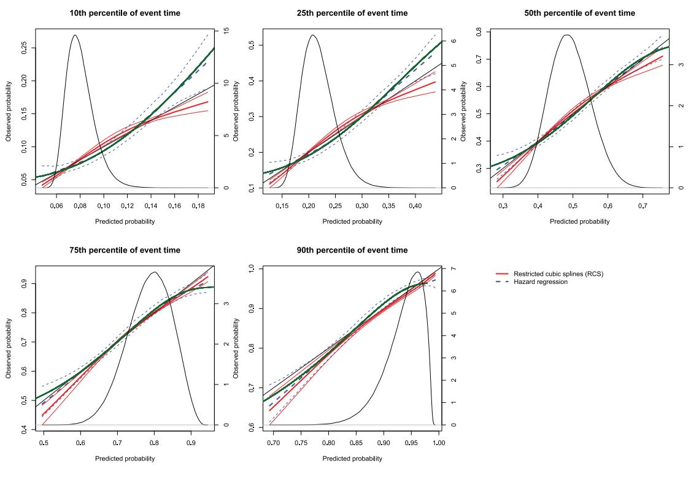

**F I G U R E 17** Calibration plots when the true model included an interaction term (N = 10,000). There are three curves for each of the two estimation methods (RCS and hazard regression). The inner curve represents the mean calibration curve across the 1000 simulation replicates. The outer two curves represent the 2.5th and 97.5th percentiles of the calibration curves across the simulation replicates. The green curve denotes the true calibration curve derived from the large super-population. The density function denotes a non-parametric estimate of the distribution of predicted risk across the large super-population (right axis) [Colour figure can be viewed at [wileyonlinelibrary.com\]](http://wileyonlinelibrary.com)

survival forest for modeling the hazard of mortality within 5 years of hospitalization for heart failure. We assess the calibration of predictions of the probability of death within 1, 2, 3, 4, and 5 years using each approach.

## **6.1 Data sources**

The Enhanced Feedback for Effective Cardiac Treatment (EFFECT) Study was an initiative to improve the quality of care for patients with cardiovascular disease in Ontario.<sup>13</sup> During the first phase, detailed clinical data were collected on patients hospitalized with congestive heart failure (CHF) between April 1, 1999 and March 31, 2001 at 86 hospital corporations in Ontario, Canada. During the second phase, data were abstracted on patients hospitalized with this condition between April 1, 2004 and March 31, 2005 at 81 Ontario hospital corporations. Data on patient demographics, vital signs and physical examination at presentation, medical history, and results of laboratory tests were collected for these two samples. The first phase of the EFFECT sample will be used for model derivation, while the second phase will be used as an independent validation sample from a different temporal period.

Data were available on 9945 and 8339 patients hospitalized with a diagnosis of CHF during the first and second phases of the study, respectively. After excluding subjects with missing data on any of the variables that will be included in our prediction models, 8240 and 7608 subjects were available from the first and second phases, respectively, for inclusion in the current study.

The outcome for the current case study was time from hospital admission to death, with subjects censored after 5 years of follow-up if death had not yet occurred. Data on both in-hospital and out-of-hospital mortality were available.

**TABLE 2** ICI, E50, and E90 in simulations with a model with an interaction

| Sample size | Percentile of event time | RCS   |       |       | Hazard regression |       |       |
|-------------|--------------------------|-------|-------|-------|-------------------|-------|-------|
|             |                          | ICI   | E50   | E90   | ICI               | E50   | E90   |
| 500         | 10                       | 0.005 | 0.005 | 0.008 | 0.009             | 0.008 | 0.014 |
| 500         | 25                       | 0.012 | 0.011 | 0.019 | 0.015             | 0.013 | 0.025 |
| 500         | 50                       | 0.018 | 0.017 | 0.032 | 0.019             | 0.017 | 0.032 |
| 500         | 75                       | 0.017 | 0.016 | 0.030 | 0.019             | 0.017 | 0.031 |
| 500         | 90                       | 0.012 | 0.010 | 0.020 | 0.013             | 0.011 | 0.023 |
| 1000        | 10                       | 0.004 | 0.004 | 0.006 | 0.007             | 0.006 | 0.012 |
| 1000        | 25                       | 0.009 | 0.009 | 0.016 | 0.012             | 0.011 | 0.020 |
| 1000        | 50                       | 0.014 | 0.014 | 0.026 | 0.015             | 0.013 | 0.025 |
| 1000        | 75                       | 0.014 | 0.013 | 0.024 | 0.016             | 0.015 | 0.026 |
| 1000        | 90                       | 0.010 | 0.008 | 0.016 | 0.011             | 0.010 | 0.019 |
| 10 000      | 10                       | 0.003 | 0.003 | 0.005 | 0.007             | 0.005 | 0.011 |
| 10 000      | 25                       | 0.007 | 0.007 | 0.012 | 0.010             | 0.008 | 0.017 |
| 10 000      | 50                       | 0.011 | 0.010 | 0.020 | 0.008             | 0.007 | 0.015 |
| 10 000      | 75                       | 0.011 | 0.010 | 0.019 | 0.010             | 0.009 | 0.018 |
| 10 000      | 90                       | 0.007 | 0.006 | 0.012 | 0.010             | 0.010 | 0.018 |

|                          | True value of ICI, E50, and E90 |       |       |
|--------------------------|---------------------------------|-------|-------|
| Percentile of event time | ICI                             | E50   | E90   |
| 10                       | 0.007                           | 0.005 | 0.009 |
| 25                       | 0.011                           | 0.009 | 0.018 |
| 50                       | 0.008                           | 0.007 | 0.011 |
| 75                       | 0.008                           | 0.005 | 0.013 |
| 90                       | 0.010                           | 0.010 | 0.017 |

## **6.2 Methods**

The candidate predictor variables considered in this case study were: age, sex, systolic blood pressure, heart rate, respiratory rate, neck vein distension, S3, S4, rales *>*50% of lung field, pulmonary edema, cardiomegaly, diabetes, cerebrovascular disease/transient ischemic attack, previous acute myocardial infarction, atrial fibrillation, peripheral vascular disease, chronic obstructive pulmonary disease, dementia, cirrhosis, cancer, left bundle branch block, hemoglobin, white blood count, sodium, potassium, glucose, urea, and creatinine.

We fit a Cox proportional hazard regression model in the derivation sample (EFFECT phase 1) in which the hazard of mortality was regressed on all the variables listed above. The fitted model was then applied to the independent validation sample (EFFECT phase 2). We also fit a random survival forest in the derivation sample, in which the hazard of mortality was modeled using the covariates listed above.11 For the random survival forest, 1000 survival trees were grown. Fivefold cross-validation was used in the derivation sample to determine the optimal number of predictor variables to be selected at each node for consideration for use in splitting that node. The optimal number of predictor variables to select was 21, when using ICI in the derivation sample as the optimization criterion. The fitted survival forest was then applied to the independent validation sample. We evaluated the calibration of these two methods in the validation sample at 1, 2, 3, 4, and 5 years post-admission. Graphical calibration curves were computed, as were ICI, E50, and E90.

The random survival forests were fit using the rfsrc function from the randomForestSRC package (version 2.7.0) for R. Software for conducting these analyses is provided in Appendices A and B.

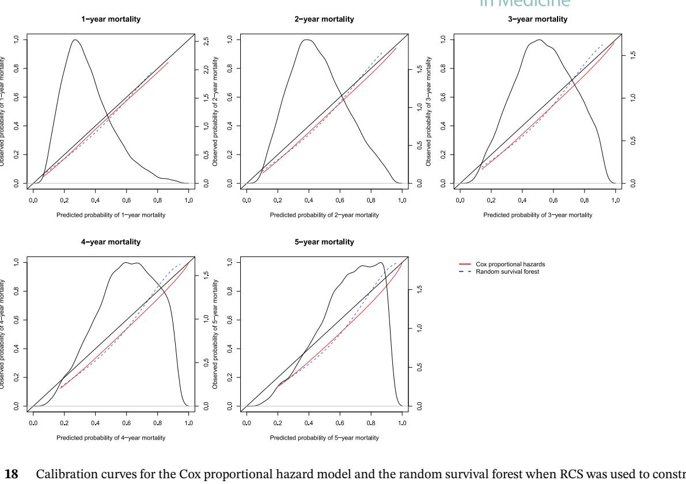

**F I G U R E 18** Calibration curves for the Cox proportional hazard model and the random survival forest when RCS was used to construct the calibration curves. There is one curve for each of the two models. The diagonal line denotes the line of perfect calibration. The density function denotes a non-parametric estimate of the distribution of predicted risk across the sample (right axis) [Colour figure can be viewed at [wileyonlinelibrary.com\]](http://wileyonlinelibrary.com)

## **6.3 Results**

The calibration plots for the two methods are described in Figures 18 (restricted cubic splines approach) and Figure 19 (hazard regression approach). Each figure consists of five panels, one each for assessing calibration at 1, 2, 3, 4, and 5 years post-admission. As in the previous figures, we have assessed calibration over an interval ranging from the first percentile of predicted probabilities to the 99th percentile of predicted probabilities. On each panel we superimposed the density function for the predicted probabilities of death within the given interval as derived from the Cox proportional hazards model. The estimated ICI, E50, and E90 are reported in Table 3.

In examining Figure 18, one observes that the Cox regression model and the random survival forests tended to have comparable calibration. The one exception was when predicting the probability of death within 5 years of hospital admission, where the random forest displayed better calibration in subjects with high predicted probabilities of mortality. With one exception, for each of the three calibration metrics (ICI, E50, and E90) and at each of the five time points (1, 2, 3, 4, and 5 years), calibration was better for the Cox proportional hazards regression model than for the random survival forest (the exception was predicting survival at 1 year and assessing calibration using the ICI). Qualitatively similar results were observed when using hazard regression to assess calibration of the two methods.

# **7 CONCLUSION**

We described two methods for constructing smoothed calibration curves for assessing the calibration of models for time-to-event outcomes. From these smoothed calibration curves, three different numerical calibration metrics can be derived that quantify differences between predicted and observed probabilities. The use of graphical calibration curves allows for an assessment of the calibration of survival models. Furthermore, the numeric calibration metrics will facilitate

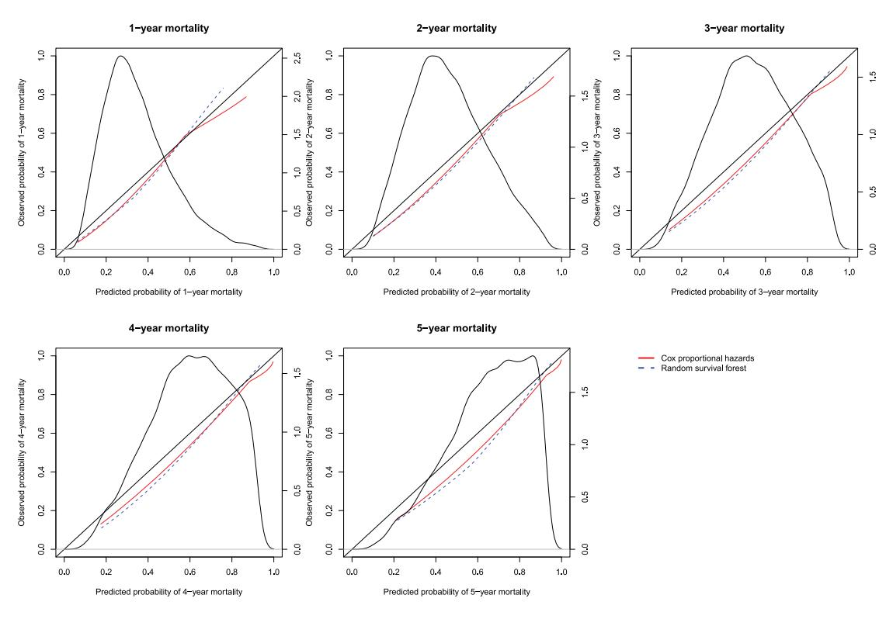

**F I G U R E 19** Calibration curves for the Cox proportional hazard model and the random survival forest when hazard regression was used to construct the calibration curves. There is one curve for each of the two models. The diagonal line denotes the line of perfect calibration. The density function denotes a non-parametric estimate of the distribution of predicted risk across the sample (right axis) [Colour figure can be viewed at [wileyonlinelibrary.com\]](http://wileyonlinelibrary.com)

**TABLE 3** ICI, E50, and E90 in the validation sample of the case study

| Time from admission (years)                        | ICI       |               | E50       |               | E90       |               |
|----------------------------------------------------|-----------|---------------|-----------|---------------|-----------|---------------|
|                                                    | Cox model | Random forest | Cox model | Random forest | Cox model | Random forest |
| Restricted cubic splines for assessing calibration |           |               |           |               |           |               |
| 1                                                  | 0.030     | 0.029         | 0.029     | 0.033         | 0.036     | 0.042         |
| 2                                                  | 0.043     | 0.045         | 0.044     | 0.050         | 0.045     | 0.066         |
| 3                                                  | 0.048     | 0.056         | 0.051     | 0.062         | 0.057     | 0.087         |
| 4                                                  | 0.048     | 0.061         | 0.051     | 0.066         | 0.065     | 0.099         |
| 5                                                  | 0.065     | 0.077         | 0.071     | 0.085         | 0.089     | 0.131         |
| Hazard regression for assessing calibration        |           |               |           |               |           |               |
| 1                                                  | 0.039     | 0.043         | 0.045     | 0.047         | 0.053     | 0.061         |
| 2                                                  | 0.045     | 0.049         | 0.051     | 0.057         | 0.058     | 0.067         |
| 3                                                  | 0.047     | 0.053         | 0.052     | 0.061         | 0.062     | 0.080         |
| 4                                                  | 0.050     | 0.052         | 0.054     | 0.055         | 0.068     | 0.092         |
| 5                                                  | 0.067     | 0.071         | 0.073     | 0.076         | 0.091     | 0.126         |

the comparison of the calibration of different models for survival data. We compared the use of flexible adaptive hazard regression with that of a Cox model using restricted cubic splines and found that they had comparable performance for constructing calibration curves. In most instances, differences between the two approaches tended to be negligible.

There is an extensive literature on assessing calibration of models for binary outcomes.1-4,14 In clinical and epidemiological research, time-to-event outcomes are also common. Methods for assessing the calibration of models for time-to-event outcomes have received less attention. The purpose of the current study was 3-fold. First, to describe methods for graphically assessing the calibration of predicted probabilities of the occurrence of an event within a given duration of time. Second, to describe numerical calibration metrics for summarizing the calibration of models for time-to-event outcomes. Third, to conduct a series of Monte Carlo simulations to evaluate the performance of these methods in a wide range of settings. The current study is, to the best of our knowledge, the most comprehensive study on methods for assessing the calibration of models for time-to-event outcomes.

We have described three different numeric metrics for assessing the calibration of survival models. We suggest that the greatest utility of these metrics will be for comparing the relative calibration of different prediction models. This was illustrated in the case study, in which, when relying on graphical calibration curves, it was difficult to assess which method had superior calibration. However, the calibration metrics were able to quantify that the Cox proportional hazards model had superior calibration compared to the random survival forest. Given that there is no reference value for what constitutes an acceptable value of ICI, E50, or E90, these metrics will have limited utility when attention is restricted to a single model. However, these metrics can serve an important function when developing a prediction model. When the prediction method includes tuning parameters (as do random survival forests), the value of these metrics can be evaluated at different values of the tuning parameter and the value that optimizes calibration can be selected. This was done in our case study.

As noted in the above, Crowson et al suggested that a set of three Poisson regression models could be used to assess the calibration of a Cox proportional hazards model.8 The first model allows for assessing calibration-in-the large, which quantifies the ratio of the number of observed events in the validation sample to the number of events predicted by the regression model. The second model allows for estimation of the calibration slope, while the third permits a comparison of observed and expected frequencies within risk strata. While the primary focus of that article was on assessing calibration using strata defined by grouping subjects with a similar predicted risk of the outcome, they note that the latter approach can be modified using regression smoothers to produce smoothed calibration plots. The current article provides several novel contributions. First, we used simulations to examine the relative performance of two different approaches to construct smoothed calibration curves. While Crowson and colleagues suggest that smoothing splines can be employed, we considered the relative performance of two different methods of producing smoothed calibration curves (RCS vs hazard regression). Second, we examined the performance of these methods in the face of model mis-specification. Third, we described numerical calibration metrics (ICI, E50, and E90) that can be derived from smoothed calibration plots. These metrics, which were originally proposed for assessing the calibration of models for binary outcomes, have not previously been extended for use with time-to-event outcomes. Fourth, our simulations allowed for an assessment of the sampling variability of both smoothed calibration curves and of the numerical calibration metrics.

In the current study, we have focused on graphical and numerical assessments of calibration. We have not focused on formal goodness-of-fit tests. The Hosmer-Lemeshow test is a commonly used statistical test for formally assessing the fit of a model for predicting the probability of binary outcomes.15,16 This test is based on comparing observed vs predicted probabilities of the outcome across strata of predicted risk. Gronnesby and Borgan developed an extension of the Hosmer-Lemeshow test for use with survival data under the assumption of proportional hazards.<sup>17</sup> D'Agostino and Nam developed a formal test for assessing the goodness-of-fit of survival models that was motivated by the Hosmer-Lemeshow test, while Demler et al modified this test to improve its type I error rate when the proportion of subjects who were censored was high.18,19 Similarly, May and Hosmer described goodness-of-fit tests for the Cox proportional hazards model that are motivated by the Hosmer-Lemeshow test.<sup>20</sup> While these tests provide a formal testing of the hypothesis of model goodness-of-fit, they do not provide information on the magnitude of mis-calibration or whether lack of calibration is only evident within a specific range of predicted risk. The methods described in the current article provide for both a qualitative (graphical) and numeric (ICI, E50, and E90) assessment of calibration.

In our final set of simulations, we observed that, despite the omission of an interaction term, the resultant mis-specified fitted model displayed good calibration. We note that under omnibus statistical tests such as general goodness-of-fit assessments (eg, calibration curve departure from line of identity, Hosmer-Lemeshow test, assessment of residuals, and Q-Q plots), specific model inadequacies (eg, omitted predictors, failure to account for nonlinearity, and omission of interactions) may not be readily apparent. Furthermore, the analyst may have difficulty tracing the lack of fit back to the root cause. Omnibus tests in general will have less power than directed tests. So, while we greatly value the importance of calibration plots, we note that their primary purpose is to assess overall model accuracy (calibration-in-the-small) and not principally to detect specific model structural problems. It is important to note that the omission of a variable can result in a mis-specified model that still displays good calibration.

There are certain limitations to the current study. Our evaluation of graphical calibration curves and calibration metrics was based on Monte Carlo simulations. Due to computational limitations and constraints on manuscript length, we were only able to examine a limited number of scenarios. These simulations were not intended to be comprehensive. Instead, we illustrated that the calibration curves performed as intended when the model was correctly specified. Furthermore, we showed that these metrics identified some forms of model mis-specification (eg, omission of a quadratic term) but not other forms of model mis-specification (eg, omission of an interaction). This latter set of simulations demonstrated that a model can display adequate calibration despite being mis-specified.

In summary, we have described and evaluated methods for constructing calibration curves of models for time-to-event outcomes and numerical calibration metrics. The use of graphical calibration curves allows for an assessment of the calibration of survival models. The numeric calibration metrics will facilitate the comparison of the calibration of different models for survival data.

# **ACKNOWLEDGEMENTS**

This study was supported by ICES, which is funded by an annual grant from the Ontario Ministry of Health and Long-Term Care (MOHLTC). The opinions, results and conclusions reported in this article are those of the authors and are independent from the funding sources. No endorsement by ICES or the Ontario MOHLTC is intended or should be inferred. This research was supported by operating grant from the Canadian Institutes of Health Research (CIHR) (MOP 86508). Dr. Austin is supported in part by a Mid-Career Investigator award from the Heart and Stroke Foundation of Ontario. The Enhanced Feedback for Effective Cardiac Treatment (EFFECT) data used in the study was funded by a CIHR Team Grant in Cardiovascular Outcomes Research (Grant numbers CTP79847 and CRT43823). Dr. van Klaveren is supported by the Patient-Centered Outcomes Research Institute (grant ME-1606-35555). The work was supported by CTSA award No. UL1 TR002243 from the National Center for Advancing Translational Sciences to the Vanderbilt Institute for Clinical and Translational Research. Its contents are solely the responsibility of the authors and do not necessarily represent official views of the National Center for Advancing Translational Sciences or the National Institutes of Health.

# **DATA AVAILABILITY STATEMENT**

The data sets used for this study were held securely in a linked, de-identified form and analysed at ICES. While data sharing agreements prohibit ICES from making the data set publicly available, access may be granted to those who meet pre-specified criteria for confidential access, available at www.ices.on.ca/DAS.

## **ORCID**

*Peter C. Austin* <https://orcid.org/0000-0003-3337-233X>

# **REFERENCES**

- 1. Harrell FE Jr. *Regression Modeling Strategies*. 2nd ed. New York, NY: Springer-Verlag; 2015.
- 2. Steyerberg EW. *Clinical Prediction Models*. 2nd ed. New York, NY: Springer-Verlag; 2019.
- 3. Austin PC, Steyerberg EW. Graphical assessment of internal and external calibration of logistic regression models by using loess smoothers. *Stat Med*. 2014;33(3):517-535.
- 4. Cox DR. Two further applications of a model for binary regression. *Biometrika*. 1958;45(3–4):592-565.
- 5. Wilson PW, D'Agostino RB, Levy D, Belanger AM, Silbershatz H, Kannel WB. Prediction of coronary heart disease using risk factor categories. *Circulation*. 1998;97(18):1837-1847.
- 6. Austin PC, Steyerberg EW. The integrated calibration index (ICI) and related metrics for quantifying the calibration of logistic regression models. *Stat Med*. 2019;38(21):4051-4065.
- 7. Kooperberg C, Stone CJ, Truong YK. Hazard regression. *J Am Stat Assoc*. 1995;90(429):78-94.
- 8. Crowson CS, Atkinson EJ, Therneau TM. Assessing calibration of prognostic risk scores. *Stat Methods Med Res*. 2016;25(4):1692-1706.
- 9. Cox DR. Regression models and life tables (with discussion). *J Royal Stat Soc Ser B*. 1972;34:187-220.
- 10. Therneau TM, Grambsch PM. *Modeling Survival Data: Extending the Cox Model*. New York, NY: Springer-Verlag; 2000.
- 11. Ishwaran H, Kogalur UB, Blackstone EH, Lauer MS. Random survival forests. *Ann Appl Stat*. 2008;2:841-860.
- 12. Bender R, Augustin T, Blettner M. Generating survival times to simulate Cox proportional hazards models. *Stat Med*. 2005;24(11):1713-1723.

- 13. Tu JV, Donovan LR, Lee DS, et al. Effectiveness of public report cards for improving the quality of cardiac care: the EFFECT study: a randomized trial. *JAMA*. 2009;302(21):2330-2337.
- 14. Nattino G, Finazzi S, Bertolini G. A new calibration test and a reappraisal of the calibration belt for the assessment of prediction models based on dichotomous outcomes. *Stat Med*. 2014;33(14):2390-2407.
- 15. Hosmer DW, Lemeshow S. *Applied Logistic Regression*. New York, NY: John Wiley & Sons; 1989.
- 16. Hosmer DW, Lemeshow S. Goodness of fit tests for the multiple logistic regression model. *Commun Stat*. 1980;9(10):1043-1069.
- 17. Gronnesby JK, Borgan O. A method for checking regression models in survival analysis based on the risk score. *Lifetime Data Anal*. 1996;2(4):315-328.
- 18. D'Agostino RB, Nam B-H. Evaluation of the performance of survival analysis models: discrimination and calibration measures. In: Balakrishnan N, Rao CR, eds. *Advances in Survival Analysis*. Amsterdam, The Netherlands: Elsevier; 2004:1-25.
- 19. Demler OV, Paynter NP, Cook NR. Tests of calibration and goodness-of-fit in the survival setting. *Stat Med*. 2015;34(10):1659-1680.
- 20. May S, Hosmer DW. Hosmer and Lemeshow type goodness-of-fit statistics for the Cox proportional hazards model. In: Balakrishnan N, Rao CR, eds. *Advances in Survival Analysis*. Amsterdan, The Netherlands: Elsevier; 2004:383-394.

**How to cite this article:** Austin PC, Harrell FE, van Klaveren D. Graphical calibration curves and the integrated calibration index (ICI) for survival models. *Statistics in Medicine*. 2020;39:2714–2742. https://doi.org/10.1002/sim.8570

# **APPENDIX A. R CODE FOR CONSTRUCTING CALIBRATION CURVES AND NUMERICAL METRICS OF CALIBRATION USING RESTRICTED CUBIC SPLINES**

```
library(survival)
library(rms)
library(randomForestSRC)
library(pec)
################################################################################
# Read in EFFECT1-HF and EFFECT2-HF databases.
# Note: The authors are not permitted to distribute the data used in the
# case study. Please do not contact the authors requesting the data.
# This code is provided for illustrative purposes only and comes with
# absolutely NO WARRANTY.
################################################################################
effect1.df <- read.table("effect1.txt",header=T)
effect2.df <- read.table("effect2.txt",header=T)
################################################################################
# Fit Cox PH model to model hazard of death. Use all baseline covariates.
################################################################################
cox1 <- coxph(Surv(survtime,mort5yr) ∼ age + female + vs.sysbp + vs.hrtrate +
  vs.resp + neckvdis + s3 + s4 + rales + pedm + cmg + diabetes + cvatia +
  prevmi + afib + perartdis + copd + dementia + cirrhos + cancer + lbbb +
  lb.hgb + lb.wbc + lb.sod + lb.pot + lb.glucose + lb.urea + lb.cr,
  x=TRUE,data=effect1.df)
predict.cox <- 1 - predictSurvProb(cox1,newdata=effect2.df,times=365*(1:5))
# Predicted probability of death within 1,2,3,4,5 years.
effect2.df$cox.1yr <- predict.cox[,1]
```

```
effect2.df$cox.2yr <- predict.cox[,2]
effect2.df$cox.3yr <- predict.cox[,3]
effect2.df$cox.4yr <- predict.cox[,4]
effect2.df$cox.5yr <- predict.cox[,5]
effect2.df$cox.1yr.cll <- log(-log(1-effect2.df$cox.1yr))</pre>
effect2.df$cox.2yr.cll <- log(-log(1-effect2.df$cox.2yr))</pre>
effect2.df$cox.3yr.cll <- log(-log(1-effect2.df$cox.3yr))</pre>
effect2.df$cox.4yr.cll <- log(-log(1-effect2.df$cox.4yr))
effect2.df$cox.5yr.cll <- log(-log(1-effect2.df$cox.5yr))</pre>
***************************************
# Survival forest
***************************************
forest1 <- rfsrc(Surv(survtime,mort5yr) ~ age + female + vs.sysbp + vs.hrtrate +</pre>
  vs.resp + neckvdis + s3 + s4 + rales + pedm + cmg + diabetes + cvatia +
 prevmi + afib + perartdis + copd + dementia + cirrhos + cancer + lbbb +
  lb.hqb + lb.wbc + lb.sod + lb.pot + lb.qlucose + lb.urea + lb.cr,
 ntree = 1000,
 nodesize = 21,
  forest = T.
 ntime = 365*(1:5),
  seed = -17072019,
  data=effect1.df)
predict.forest <- 1 - predict(forest1,newdata=effect2.df)$survival</pre>
effect2.df$forest.1yr <- predict.forest[,1]</pre>
effect2.df$forest.2yr <- predict.forest[,2]</pre>
effect2.df$forest.3yr <- predict.forest[,3]</pre>
effect2.df$forest.4yr <- predict.forest[,4]
effect2.df$forest.5yr <- predict.forest[,5]</pre>
effect2.df$forest.1yr.cll <- log(-log(1-effect2.df$forest.1yr))</pre>
effect2.df$forest.2yr.cll <- log(-log(1-effect2.df$forest.2yr))</pre>
effect2.df$forest.3yr.cll <- log(-log(1-effect2.df$forest.3yr))</pre>
effect2.df$forest.4yr.cll <- log(-log(1-effect2.df$forest.4yr))</pre>
effect2.df$forest.5yr.cll <- log(-log(1-effect2.df$forest.5yr))</pre>
***************************************
# Calibration for predictions of 1-year survival probabilities
***************************************
calibrate.cox <- coxph(Surv(survtime,mort5yr) ~ rcs(cox.1yr.cll,3),x=T,</pre>
  data=effect2.df)
calibrate.forest <- coxph(Surv(survtime,mort5yr) ~ rcs(forest.1yr.cll,3),x=T,</pre>
  data=effect2.df)
predict.grid.cox <- seq(quantile(effect2.df$cox.1yr,probs=0.01),</pre>
                       quantile(effect2.df$cox.1yr,probs=0.99),length=100)
predict.grid.cox.cll <- log(-log(1-predict.grid.cox))</pre>
```

```
AUSTIN et al. 2739
predict.grid.forest <- seq(quantile(effect2.df$forest.1yr,probs=0.01),
                  quantile(effect2.df$forest.1yr,probs=0.99),
```

```
length=100)
predict.grid.forest.cll <- log(-log(1-predict.grid.forest))
predict.grid.cox.df <- data.frame(predict.grid.cox)
predict.grid.cox.cll.df <- data.frame(predict.grid.cox.cll)
predict.grid.forest.df <- data.frame(predict.grid.forest)
predict.grid.forest.cll.df <- data.frame(predict.grid.forest.cll)
names(predict.grid.cox.df) <- "cox.1yr"
names(predict.grid.cox.cll.df) <- "cox.1yr.cll"
names(predict.grid.forest.df) <- "forest.1yr"
names(predict.grid.forest.cll.df) <- "forest.1yr.cll"
predict.calibrate.cox <- 1 - predictSurvProb(calibrate.cox,
  newdata=predict.grid.cox.cll.df,times=1*365)
predict.calibrate.forest <- 1 - predictSurvProb(calibrate.forest,
  newdata=predict.grid.forest.cll.df,times=1*365)
# Predicted probability of death within 1 year.
plot(predict.grid.cox,predict.calibrate.cox,type="l",lty=1,col="red",
  xlim=c(0,1),ylim=c(0,1),
  xlab = "Predicted probability of 1-year mortality",
  ylab = "Observed probability of 1-year mortality")
lines(predict.grid.forest,predict.calibrate.forest,type="l",lty=2,col="blue")
abline(0,1)
title("1-year mortality")
par(new=T)
plot(density(effect2.df$cox.1yr),axes=F,xlab=NA,ylab=NA,main="")
axis(side=4)
################################################################################
# ICI for 1-year probabilities.
################################################################################
predict.calibrate.cox <- 1 - predictSurvProb(calibrate.cox,
  newdata=effect2.df,times=1*365)
predict.calibrate.forest <- 1 - predictSurvProb(calibrate.forest,
  newdata=effect2.df,times=1*365)
# Predicted probability of death within 1 year for all subjects in
# validation sample.
ICI.1yr.cox <- mean(abs(effect2.df$cox.1yr – predict.calibrate.cox))
ICI.1yr.forest <- mean(abs(effect2.df$forest.1yr – predict.calibrate.forest))
E50.1yr.cox <- median(abs(effect2.df$cox.1yr – predict.calibrate.cox))
E50.1yr.forest <- median(abs(effect2.df$forest.1yr – predict.calibrate.forest))
E90.1yr.cox <- quantile(abs(effect2.df$cox.1yr – predict.calibrate.cox),probs=0.9)
```

```
E90.1yr.forest <- quantile(abs(effect2.df$forest.1yr – predict.calibrate.forest),probs=0.9)
cat(1,ICI.1yr.cox,ICI.1yr.forest,E50.1yr.cox,E50.1yr.forest,
     E90.1yr.cox,E90.1yr.forest,file="ICI.out",fill=T,append=T)
                                                                                                                                                                                                                                   10970258, 2020, 21, Downloaded from https://onlinelibrary.wiley.com/doi/10.1002/sim.8570, Wiley Online Library on [25/06/2026]. See the Terms and Conditions (https://onlinelibrary.wiley.com/terms-and-conditions) on Wiley Online Library for rules of use; OA articles are governed by the applicable Creative Commons License
```

# **APPENDIX B. R CODE FOR CONSTRUCTING CALIBRATION CURVES AND NUMERICAL METRICS OF CALIBRATION USING HAZARD REGRESSION**

```
library(survival)
library(rms)
library(randomForestSRC)
library(pec)
library(polspline)
################################################################################
# Read in EFFECT1-HF and EFFECT2-HF databases.
# Note: The authors are not permitted to distribute the data used in the
# case study. Please do not contact the authors requesting the data.
# This code is provided for illustrative purposes only and comes with
# absolutely NO WARRANTY.
################################################################################
effect1.df <- read.table("effect1.txt",header=T)
effect2.df <- read.table("effect2.txt",header=T)
################################################################################
# Fit Cox PH model to model hazard of death. Use all baseline covariates.
################################################################################
cox1 <- coxph(Surv(survtime,mort5yr) ∼ age + female + vs.sysbp + vs.hrtrate +
  vs.resp + neckvdis + s3 + s4 + rales + pedm + cmg + diabetes + cvatia +
  prevmi + afib + perartdis + copd + dementia + cirrhos + cancer + lbbb +
  lb.hgb + lb.wbc + lb.sod + lb.pot + lb.glucose + lb.urea + lb.cr,
  x=TRUE,data=effect1.df)
predict.cox <- 1 – predictSurvProb(cox1,newdata=effect2.df,times=365*(1:5))
# Predicted probability of death within 1,2,3,4,5 years.
effect2.df$cox.1yr <- predict.cox[,1]
effect2.df$cox.2yr <- predict.cox[,2]
effect2.df$cox.3yr <- predict.cox[,3]
effect2.df$cox.4yr <- predict.cox[,4]
effect2.df$cox.5yr <- predict.cox[,5]
effect2.df$cox.1yr <- ifelse(effect2.df$cox.1yr==1,0.9999,effect2.df$cox.1yr)
effect2.df$cox.2yr <- ifelse(effect2.df$cox.2yr==1,0.9999,effect2.df$cox.2yr)
effect2.df$cox.3yr <- ifelse(effect2.df$cox.3yr==1,0.9999,effect2.df$cox.3yr)
effect2.df$cox.4yr <- ifelse(effect2.df$cox.4yr==1,0.9999,effect2.df$cox.4yr)
effect2.df$cox.5yr <- ifelse(effect2.df$cox.5yr==1,0.9999,effect2.df$cox.5yr)
effect2.df$cox.1yr.cll <- log(-log(1-effect2.df$cox.1yr))
```

# Survival forest

ntree = 1000, nodesize = 21, forest = T,

ntime = 365\*(1:5),seed = -17072019, data=effect1.df)

```
Statistics
                                                                     -WILEY-
effect2.df$cox.2yr.cll <- log(-log(1-effect2.df$cox.2yr))</pre>
effect2.df$cox.3yr.cll <- log(-log(1-effect2.df$cox.3yr))
effect2.df$cox.4yr.cll <- log(-log(1-effect2.df$cox.4yr))
effect2.df$cox.5yr.cll <- log(-log(1-effect2.df$cox.5yr))</pre>
#######################################
***************************************
forest1 <- rfsrc(Surv(survtime,mort5yr) ~ age + female + vs.sysbp + vs.hrtrate +</pre>
  vs.resp + neckvdis + s3 + s4 + rales + pedm + cmg + diabetes + cvatia +
  prevmi + afib + perartdis + copd + dementia + cirrhos + cancer + lbbb +
  lb.hqb + lb.wbc + lb.sod + lb.pot + lb.qlucose + lb.urea + lb.cr,
predict.forest <- 1 - predict(forest1, newdata=effect2.df) $survival</pre>
effect2.df$forest.1yr <- predict.forest[,1]</pre>
effect2.df$forest.2yr <- predict.forest[,2]</pre>
effect2.df$forest.3yr <- predict.forest[,3]</pre>
effect2.df$forest.4yr <- predict.forest[,4]
effect2.df$forest.5yr <- predict.forest[,5]</pre>
effect2.df$forest.1yr.cll <- log(-log(1-effect2.df$forest.1yr))</pre>
effect2.df$forest.2yr.cll <- log(-log(1-effect2.df$forest.2yr))</pre>
effect2.df$forest.3yr.cll <- log(-log(1-effect2.df$forest.3yr))</pre>
effect2.df$forest.4yr.cll <- log(-log(1-effect2.df$forest.4yr))</pre>
effect2.df$forest.5yr.cll <- log(-log(1-effect2.df$forest.5yr))</pre>
#######################################
# Calibration for predictions of 1-year survival probabilities
***************************************
calibrate.cox <- hare(data=effect2.df$survtime,delta=effect2.df$mort5yr,</pre>
  cov=as.matrix(effect2.df$cox.1yr.cll))
calibrate.forest <- hare(data=effect2.df$survtime,delta=effect2.df$mort5yr,</pre>
  cov=as.matrix(effect2.df$forest.1yr.cll))
predict.grid.cox <- seq(quantile(effect2.df$cox.1yr,probs=0.01),</pre>
                        quantile(effect2.df$cox.1yr,probs=0.99),length=100)
predict.grid.forest <- seq(quantile(effect2.df$forest.lyr,probs=0.01),</pre>
                        quantile(effect2.df$forest.1yr,probs=0.99),length=100)
predict.grid.cox.cll <- log(-log(1-predict.grid.cox))</pre>
predict.grid.forest.cll <- log(-log(1-predict.grid.forest))</pre>
predict.calibrate.cox <- phare(1*365,predict.grid.cox.cll,calibrate.cox)</pre>
predict.calibrate.forest <- phare(1*365,predict.grid.forest.cll,calibrate.forest)</pre>
```

```
# Predicted probability of death within 1 year.
plot(predict.grid.cox,predict.calibrate.cox,type="l",lty=1,col="red",
  xlim=c(0,1),ylim=c(0,1),
  xlab = "Predicted probability of 1-year mortality",
  ylab = "Observed probability of 1-year mortality")
lines(predict.grid.forest,predict.calibrate.forest,type="l",lty=2,col="blue")
abline(0,1)
title("1-year mortality")
par(new=T)
plot(density(effect2.df$cox.1yr),axes=F,xlab=NA,ylab=NA,main="")
axis(side=4)
################################################################################
# ICI for 1-year probabilities.
################################################################################
predict.calibrate.cox <- phare(1*365,effect2.df$cox.1yr.cll,calibrate.cox)
predict.calibrate.forest <- phare(1*365,effect2.df$forest.1yr.cll,calibrate.forest)
# Predicted probability of death within 1 year for all subjects in
# validation sample.
ICI.1yr.cox <- mean(abs(effect2.df$cox.1yr - predict.calibrate.cox))
ICI.1yr.forest <- mean(abs(effect2.df$forest.1yr - predict.calibrate.forest))
E50.1yr.cox <- median(abs(effect2.df$cox.1yr - predict.calibrate.cox))
E50.1yr.forest <- median(abs(effect2.df$forest.1yr - predict.calibrate.forest))
E90.1yr.cox <- quantile(abs(effect2.df$cox.1yr - predict.calibrate.cox),probs=0.9)
E90.1yr.forest <- quantile(abs(effect2.df$forest.1yr - predict.calibrate.forest),probs=0.9)
cat(1,ICI.1yr.cox,ICI.1yr.forest,E50.1yr.cox,E50.1yr.forest,
  E90.1yr.cox,E90.1yr.forest,file="ICI.out",fill=T,append=T)
################################################################################
# Note that in the rms package for R, the functions calibrate.cph and
# calibrate.psm allow one to plot calibration curves using the polspline package
# to flexibly estimate the calibration curves.
################################################################################
```