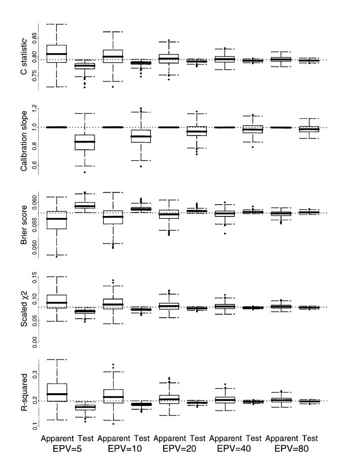
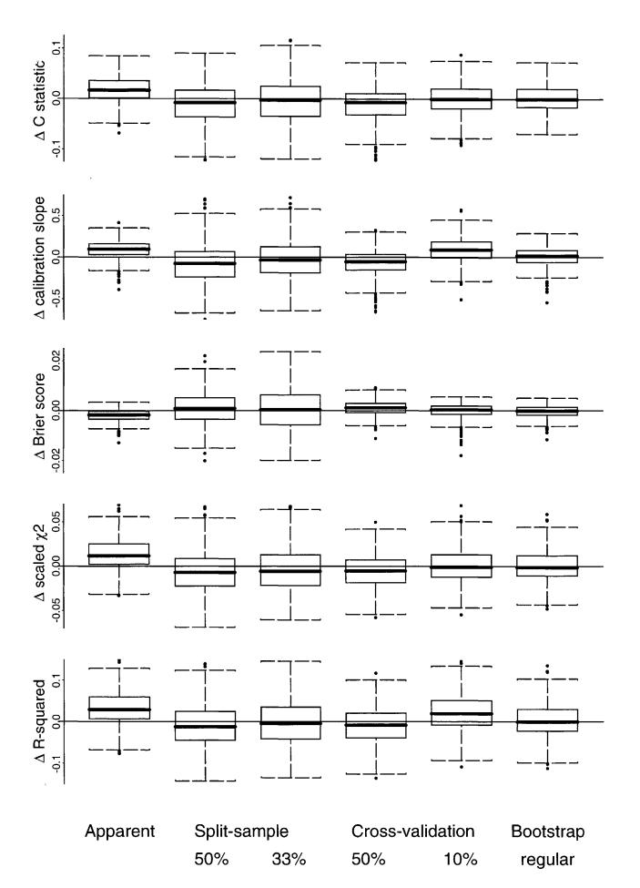

Journal of Clinical Epidemiology 54 (2001) 774–781

# Internal validation of predictive models: Efficiency of some procedures for logistic regression analysis

Ewout W. Steyerberga,\*, Frank E. Harrell Jrb , Gerard J. J. M. Borsbooma , M. J. C. (René) Eijkemansa , Yvonne Vergouwea , J. Dik F. Habbemaa

a *Center for Clinical Decision Sciences, Ee 2091, Department of Public Health, Erasmus University, P.O. Box 1738, 3000 DR, Rotterdam, The Netherlands* b *Division of Biostatistics and Epidemiology, Department of Health Evaluation Sciences, University of Virginia, Charlottesville VA, USA* Received 28 June 2000; received in revised form 26 October 2000; accepted 20 December 2000

## **Abstract**

The performance of a predictive model is overestimated when simply determined on the sample of subjects that was used to construct the model. Several internal validation methods are available that aim to provide a more accurate estimate of model performance in new subjects. We evaluated several variants of split-sample, cross-validation and bootstrapping methods with a logistic regression model that included eight predictors for 30-day mortality after an acute myocardial infarction. Random samples with a size between *n* - 572 and *n* -9165 were drawn from a large data set (GUSTO-I; *n* - 40,830; 2851 deaths) to reflect modeling in data sets with between 5 and 80 events per variable. Independent performance was determined on the remaining subjects. Performance measures included discriminative ability, calibration and overall accuracy. We found that split-sample analyses gave overly pessimistic estimates of performance, with large variability. Cross-validation on 10% of the sample had low bias and low variability, but was not suitable for all performance measures. Internal validity could best be estimated with bootstrapping, which provided stable estimates with low bias. We conclude that split-sample validation is inefficient, and recommend bootstrapping for estimation of internal validity of a predictive logistic regression model. © 2001 Elsevier Science Inc. All rights reserved.

*Keywords:* Predictive models; Internal validation; Logistic regression analysis; Bootstrapping

## **1. Introduction**

Predictive models are important tools to provide estimates of patient outcome [1]. A predictive model may well be constructed with regression analysis in a data set with information from a series of representative patients. The apparent performance of the model on this training set will be better than the performance in another data set, even if the latter test set consists of patients from the same population [1–6]. This 'optimism' is a well-known statistical phenomenon, and several approaches have been proposed to estimate the performance of the model in independent subjects more accurately than based on a naive evaluation on the training sample [3,7–9].

A straightforward and fairly popular approach is to randomly split the training data in two parts: one to develop the model and another to measure its performance. With this split-sample approach, model performance is determined on similar, but independent, data [9].

\* Corresponding author. Tel.: 31-10-408 7053; fax: 31-0-408 9455. *E-mail address:* steyerberg@mgz.fgg.eur.nl (E.W. Steyerberg)

A more sophisticated approach is to use cross-validation, which can be seen as an extension of the split-sample method. With split-half cross-validation, the model is developed on one randomly drawn half and tested on the other and vice versa. The average is taken as estimate of performance. Other fractions of subjects may be left out (e.g., 10% to test a model developed on 90% of the sample). This procedure is repeated 10 times, such that all subjects have once served to test the model. To improve the stability of the cross-validation, the whole procedure can be repeated several times, taking new random subsamples. The most extreme cross-validation procedure is to leave one subject out at a time, which is equivalent to the jack-knife technique [7].

The most efficient validation has been claimed to be achieved by computer-intensive resampling techniques such as the bootstrap [8]. Bootstrapping replicates the process of sample generation from an underlying population by drawing samples with replacement from the original data set, of the same size as the original data set [7]. Models may be developed in bootstrap samples and tested in the original sample or in those subjects not included in the bootstrap sample [3,8].

In this study we compare the efficiency of internal validation procedures for predictive logistic regression models. Internal validation refers to the performance in patients from a similar population as where the sample originated from. Internal validation is in contrast to external validation, where various differences may exist between the populations used to develop and test the model [10]. We vary the sample size from small to large. As an indicator of sample size we use the number of events per variable (EPV); low EPV values indicate that many parameters are estimated in relation to the information in the data [11,12]. We study a number of measures of predictive performance, and we will show that bootstrapping is generally superior to other approaches to estimate internal validity.

## 2. Patients and Methods

### 2.1. Patients

We analyzed 30-day mortality in a large data set of patients with acute myocardial infarction (GUSTO-I) [13,14]. This data set has been used before to study methodological aspects of regression modeling [15–18]. In brief, this data set consists of 40,830 patients, of whom 2851 (7.0%) had died at 30 days.

### 2.2. Simulation study

Random samples were drawn from the GUSTO-I data set, with sample size varied according to the number of events per variable (EPV). We studied the validity of EPV as an indicator of effective sample size in our study by varying the mortality from 7% to 1% or 20% for EPV 10. This is similar to changing the ratio of controls to cases in a case-control study, with 20% mortality reflecting a 4:1 ratio and 1% reflecting a 99:1 ratio.

We used EPV values of 5, 10, 20, 40 and 80. We fixed the incidence of the outcome in every sample by stratified sampling according to the outcome (dead/alive at 30 days). This implies that every sample contained exactly the same number of events (patients who died) and nonevents (patients who survived) for a given EPV value. Simulations were repeated 500 times. It has been suggested that EPV should be at least 10 to provide an adequate predictive model [11,12]. We therefore present detailed results for this EPV value.

A logistic regression model was fitted in each sample consisting of a previously specified set of eight dichotomous predictors: shock, age>65 years, high risk (anterior infarct location or previous MI), diabetes, hypotension (systolic blood pressure <100 mmHg), tachycardia (pulse>80), relief of chest pain>1 hr, female gender [19]. Characteristics of these predictors in the GUSTO-I data set were previously described [16,18]. In addition to prespecified models, some evaluations were performed for stepwise selected models. We applied stepwise selection with backward elimination of predictors from the full eight-predictor model with  $P \ge .05$  for exclusion.

For each sample, an independent test set was created consisting of all patients from GUSTO-I except the patients in the random sample. For example, for EPV=10 and 7.0% mortality, all training and test samples consisted of 1145 and 39,685 patients, with 80 and 2771 deaths, respectively. Predictive performance was estimated on the training sample ('apparent' or 'resubstitution' performance) and on the test data (test performance, considered as 'gold standard'). Further, we used the apparent performance of the model fitted in the total GUSTO-I data set as a reference for what performance might maximally be obtained. The large size of the total GUSTO-I data set makes sure that the optimism in this performance estimate is negligible.

### 2.3. Predictive performance

Several measures of predictive performance were considered. Discrimination refers to the ability to distinguish high-risk subjects from low-risk subjects, and is commonly quantified by a measure of concordance, the c statistic. For binary outcomes, c is identical to the area under the receiver operating characteristic (ROC) curve; c varies between 0.5 and 1.0 for sensible models (the higher the better) [1,11,20].

Calibration refers to whether the predicted probabilities <table-cell> of prediction models is that predictions for new subjects are too extreme (i.e, that the observed probability of the outcome is higher than predicted for low-risk subjects and lower than predicted for high-risk subjects) [1,4,20]. To quantify this miscalibration we studied the slope of the linear predictor ('calibration slope'), as originally proposed by Cox [21]. The calibration slope is the regression coefficient β in a logistic model with the linear predictor as the only co-The observed mortality is coded binary (0/1), and the prognostic index is calculated as the linear combination of the regression coefficients as estimated in a sample with the values of the covariables for each patient in the test data. Well-calibrated models have a slope of 1, while models pro-slope of the linear predictor is identical to the uniform 'shrinkage' factor, as discussed by others [2,5].

Furthermore, we studied measures that quantify the overall accuracy of predictions. The Brier score (or average prediction error) is calculated as  $\sum (y_i - p_i)^2 / n$ , where y denotes the observed outcome and p the prediction for subject i in the data set of n subjects [22]. For sensible models the Brier score ranges from 0 (perfect) to 0.25 (worthless). Next, the D statistic was used, which is calculated as (model chi-square -1) /n, where n is the number of subjects [11]. D is a scaled version of the model chi-square, which is calculated on the log-likelihood scale and which is closely related to the Kullback–Leibler distance. We note that the Brier score is a quadratic scoring rule, and D a logarithmic one [23]. Finally, we studied Nagelkerke's  $R^2$  as a measure of explained variation, which is calculated on the log-likelihood scale [24].

### 2.4. Internal validation

We evaluated several internal validation procedures that aim to estimate test performance more accurately than is achieved by the apparent performance estimate (Table 1). Split-sample methods are referred to as the split-half and split 1/3 method, where 50% or 33.33% of the sample were kept as an independent evaluation part for the logistic regression model that was estimated on 50% or 66.67% of the sample, respectively. The split was made once and at random.

Cross-validation was performed with 50% or 10% of the data consecutively serving as a test part. Models were estimated on one part of the data (50% or 90%, respectively) and tested on the independent part. The average performance was calculated over 2 or 10 repetitions, respectively. As a variant, the 10% cross-validation was repeated 10 times to study whether stability improved by increasing the number of evaluations from 10 to 100 (referred to as  $10\times10\%$  cross-validation). Cross-validation with leaving single subjects out (the 'jackknife') was not studied, since many of the performance measures that we studied cannot be evaluated for single subjects. When stepwise selection was applied, it was applied in every training sample.

Bootstrap resampling started with fitting the logistic model in a bootstrap sample of *n* subjects, which was drawn with replacement from the original sample [7]. Averages of performance measures were taken over 100 repetitions (EPV 5, 10, 20) or 50 repetitions (EPV 40 or 80). These numbers were chosen since it was found that higher numbers only marginally improved the estimates. When stepwise selection was applied, it was applied in every bootstrap sample.

For the regular bootstrap procedure, the model as estimated in the bootstrap sample was evaluated in the bootstrap sample and in the original sample. The performance in the bootstrap sample represents estimation of the apparent performance, and the performance in the original sample represents test performance. The difference between these performances is an estimate of the optimism in the apparent performance. This difference is averaged to obtain a stable estimate of the optimism. The optimism is subtracted from

the apparent performance to estimate the internally validated performance [7]: estimated performance = apparent performance - average(bootstrap performance - test performance).

Furthermore, two bootstrap resampling variants were studied: the .632 and .632+ method. With the .632 method, the model as estimated in the bootstrap sample was evaluated on the subjects not sampled [3]. This method can be seen as a direct extension of cross-validation, since the evaluation is on independent data. On average, 63.2% of the subjects are at least once included in a bootstrap sample, giving the method its name. The estimated performance is a weighted combination of apparent and test performance: estimated performance =  $.368 \times apparent performance +$  $0.632 \times \text{test}$  performance. Efron developed the .632 method only for the case where the performance measure being bootstrapped is estimated on a per-subject basis (e.g., misclassification error) [3]. A natural generalization of this method can be derived by assuming that the accuracy evaluated on subject i that is omitted from a bootstrap sample has the same expectation as the accuracy of any other subject <section-header> mance can then be calculated as the weighted average of the frequency of inclusion of observation i in the bootstrap samples. More details on this implementation can be found elsewhere [25].

Finally, the .632+ method was applied, which is an extension of the .632 method. Here, the weights for the estimated performance are dependent on the amount of overfitting [8]: estimated performance =  $(1 - w) \times$  apparent performance +  $w \times$  test performance. The weight w is determined by the relative overfitting R:  $w = .632 / (1 - .368 \times R)$ , with R determined by the ratio of the difference in test and apparent performance to the difference between 'no information' and apparent performance: R = (test performance – apparent performance). Hence, the relative overfitting R is large when the difference between test and apparent performance is relatively large. In this case, R and w approach 1, implying that

Table 1
Procedures considered to estimate internal validity of a logistic regressin model with eight predictors

| Method           |                 | Training sample    | Test sample                                    | Estimated performance                                                     | Repetitions       |
|------------------|-----------------|--------------------|------------------------------------------------|---------------------------------------------------------------------------|-------------------|
| Apparent         |                 | Original           | Original                                       | Original sample                                                           | 1                 |
| Split-sample     | 50%             | 50% of original    | Independent: 50% of original                   | Test                                                                      | 1                 |
|                  | 33%             | 66.67% of original | Independent: 33.33% of original                | Test                                                                      | 1                 |
| Cross-validation | 50%             | 50% of original    | Independent: 50% of original                   | Average(test)                                                             | 2                 |
|                  | 10%             | 90% of original    | Independent: 10% of original                   | Average(test)                                                             | 10                |
|                  | 10 $\times$ 10% | 90% of original    | Independent: 10% of original                   | Average(test)                                                             | 100               |
| Bootstrapping    | Regular         | Bootstrap          | Original                                       | Apparent - average(bootstrap-test)                                        | 100 $^{\text{a}}$ |
|                  | .632            | Bootstrap          | Independent: subjects not sampled in bootstrap | $0.368 \times \text{Apparent} + 0.632 \times \text{average(test)}$        | 100 $^{\text{a}}$ |
|                  | .632+           | Bootstrap          | Independent: subjects not sampled in bootstrap | $(1-w) \times \text{Apparent} + w \times \text{average(test)}^{\text{b}}$ | 100 $^{\text{a}}$ |

&lt;sup>a100 bootstrap samples were drawn for EPV 5, 10 or 20, while 50 samples were used for EPV 40 or 80.

&lt;sup>bThe weight w was calculated as:  $w=.632 / (1 - .368 \times R)$ , with R= (test performance – apparent performance) /("no information" performance – apparent performance)[8](see text).

the performance estimated is largely based on the test performance estimate. When the overfitting is small, *R* approaches 0 and *w* 0.632, resulting in similarity between the .632 and .632 method. The 'no information' performance can sometimes be calculated with relatively simple analytical solutions (e.g., for the misclassification error) [8]. Since we included non-per-subject measures, this was not directly possible. We approximated the 'no information' performance by taking the average of the performance in the original sample where the outcome was randomly permuted, repeated as often as the number of bootstraps (100 or 50 repetitions). For example, the average no information performance was 0.5 for the *c* statistic.

### *2.5. Evaluation*

The accuracy of the internal validation procedures was assessed graphically with box-plots. The box included the median and interquartile range, with whiskers drawn to the nearest values not beyond 1.5 times the interquartile range. Box-plots were constructed for the distribution of apparent and test performance and for the difference between estimated performance (according to various methods) and test performance. The bias of an internal validation method was calculated as the average difference between estimated performance and test performance. As a summary measure for accuracy, we calculated the root mean squared error (RMSE) of every internal validation method. MSE was calculated as (*ivi gi* ) /*N*, where *iv* denotes the internal validity estimate and *g* the gold standard performance for sample *i* of *N* samples. Taking the square root brings the MSE back on the original scale of the performance measure. The RMSE combines bias and variability; a procedure with some bias but low variability may have a lower MSE than an unstable procedure with low bias.

Calculations were performed with S-plus software (Math-Soft, Inc., Seattle WA, version 2000). We used functions from the Design library for logistic regression (1rm) and validation (validate) [25]. The validate function was extended to incorporate the .632 variant of bootstrap evaluation.

## **3. Results**

### *3.1. Optimism in apparent performance*

In Fig. 1 we show the apparent and test performance of the logistic regression model with eight predictors in relation to sample size, as indicated by the number of events per variable (EPV). The apparent performance was determined on random samples from the GUSTO-I data set, with sample sizes (number of deaths) of *n* - 572 (40), *n* - 1145 (80), *n* - 2291 (160), *n* - 4582 (320), *n* - 9165 (640) for EPV 5, 10, 20, 40, and 80, respectively. For all performance measures, we note optimism in the apparent performance [i.e., the model performance in independent data ('test') was on average worse than the performance in the sample where the model was constructed ('apparent')]. The optimism was largest for small sample sizes, where the apparent performance was clearly estimated above the line, indicating the performance in the total GUSTO-I data set. The test performance clearly below it. With large sample size (EPV - 40 or 80) the median apparent and test performance were close to the performance in the total data set. In addition to a reduction in optimism, we also note a reduction in the variability of the model performance estimates with increasing sample size. For example, for EPV - 5, the median apparent *c* was 0.807 and the median test *c* 0.774, while these numbers were 0.795 and 0.791 for EPV - 40, with *c* .0793 in the total data set. The apparent *c* overestimated the test *c* in 84% of the samples with EPV - 5, while this percentage decreased to 64% for EPV -40.

### *3.2. Internal validation when EPV*-*10*

In Fig. 2, we show the bias and variability for a selected number of procedures to estimate the model performance in independent data for EPV - 10 (*n* - 1145, 80 deaths). We note that the apparent performance was optimistic but had relatively low variability. The split-half method underestimated model performance and had larger variability. The

Fig. 1. Estimated apparent and test performance for a eight-predictor logistic regression model in data sets with 5 to 80 events per variable (EPV). Box-plots are shown for 500 repetitions of randomly drawn training and independent test samples from the GUSTO-I data set (*n* - 40,830). The dotted line indicates the performance in the total GUSTO-I data set.

split 1/3 method had lower bias but larger variability. Compared with the split-half method, cross-validation on 50% of the sample resulted in a similar bias but slightly reduced variability. The 10% cross-validation procedure resulted in very low bias for most measures, except for calibration slope and *R*2 , where a substantial overestimation occurred. The regular bootstrap resulted in the most accurate estimates of model performance: the bias was close to zero and the variability similar to that of the apparent performance.

Further results of the validation techniques are presented in Table 2 for EPV - 10, focusing on bias and RMSE. We found that the split-sample approaches led to a larger RMSE than using the apparent performance as estimate of internal validity. Cross-validation gave best results when 10% was used as a test set, and the procedure repeated 10 times. Tenfold repetition led to a reduction in RMSE of around 15% for EPV - 10. The .632 variant of the bootstrap gave somewhat more pessimistic estimates of performance than the regular bootstrap procedure, but had a similar RMSE for the *c* statistic and calibration slope, a worse RMSE for the Brier

Fig. 2. Differences between estimated and test performance in data sets with EPV - 10, according to some of the studied internal validation procedures: apparent performance, split-sample validation on 50% or 33% of the sample, cross-validation on 50% or 10% of the sample, and regular bootstrapping.

score, and a lower RMSE for *D* (scaled chi-square) and *R*2 . The .632 was by definition more pessimistic in estimating performance than the .632 method. It did not lead to a lower RMSE in our evaluations.

### *3.3. Influence of sample size*

The ranking of internal validation techniques was largely similar for other EPV values. The regular bootstrap resulted in the lowest RMSE for all measures with EPV 5, 10 or 20, and was similar to 10% cross-validation or the apparent performance for EPV 40 or 80. For EPV - 5, 10% cross-validation and the apparent performance performed similarly, and split 1/3 performed worst. For large sample sizes (EPV -40 or 80), differences between methods were small. For these sample sizes the apparent performance had a lower RMSE for all measures compared with split-sample or splithalf cross-validation.

Further, we found that EPV was the main determinant of effective sample size in our study. For EPV - 10 (80 events), models were constructed in larger (*n* - 8000) or smaller data sets (*n* - 400) by decreasing or increasing the mortality (to 1% or 20%, respectively). The average model performance was only slightly affected, as well as the bias and RMSE. For example, for the *c* statistic, the apparent estimate was on average 0.798 or 0.802 with 0.785 or 0.781 in the test data—corresponding to a bias of 0.013 or 0.021 and RMSE was 0.028 or 0.035, for *n* - 8000 or *n* - 400, respectively.

### *3.4. Stepwise selection*

Stepwise selection led to an average performance that was slightly worse than that of the full eight-predictor model for EPV - 10. When stepwise and prespecified models were evaluated in the test data, the average *c* statistics were 0.77 and 0.78, calibration slopes 0.89 and 0.91, Brier scores 0.059 and 0.058, *D* 0.069 and 0.075, and *R*2 0.17 and 0.18, respectively. The bias in the apparent performance was slightly larger than that observed for prespecified models. The performance was estimated in an nearly unbiased and precise way by any of the bootstrap variants, while other procedures resulted in less accurate estimates.

## **4. Discussion**

Accurate estimation of the internal validity of a predictive regression model is especially problematic when the sample size is small. The apparent performance as estimated in the sample then is a substantial overestimation of the true performance in similar subjects. In our study, split-sample approaches underestimated performance and showed high variability. In contrast, bootstrap resampling resulted in stable and nearly unbiased estimates of performance.

Methods to assess internal validity vary in the amount of data that are used to estimate the model and the amount of data kept out to test the model (Table 1). With the split-half

Table 2 Observed bias and square root of the mean squared error for various internal validation procedures, EPV -10 (*n* - 1145, 80 deaths)

| Method           |            | c statistic |      | Calibration slope |      | Brier score |      | D ( $=scaled χ$ 2) |      | R2    |      |
|------------------|------------|-------------|------|-------------------|------|-------------|------|--------------------|------|-------|------|
|                  |            | Bias        | RMSE | Bias              | RMSE | Bias        | RMSE | Bias               | RMSE | Bias  | RMSE |
| Apparent         |            | +.018       | .033 | +.088             | .140 | -.002       | .003 | +.013              | .022 | +.032 | .052 |
| Split-sample     | 50%        | -.010       | .039 | -.073             | .234 | +.002       | .007 | -.005              | .024 | -.009 | .054 |
|                  | 33%        | +.000       | .048 | -.002             | .260 | +.000       | .008 | -.000              | .031 | +.005 | .065 |
| Cross-validation | 50%        | -.010       | .035 | -.070             | .179 | +.000       | .003 | -.005              | .020 | -.009 | .045 |
|                  | 10%        | -.001       | .034 | +.086             | .188 | -.000       | .004 | -.000              | .020 | +.020 | .050 |
|                  | 10 $×$ 10% | -.002       | .031 | +.089             | .178 | +.000       | .003 | -.000              | .019 | +.019 | .045 |
| Bootstrapping    | Regular    | +.001       | .030 | +.009             | .121 | -.000       | .003 | +.000              | .018 | +.003 | .042 |
|                  | .632       | -.011       | .032 | -.037             | .119 | -.002       | .006 | -.019              | .020 | -.000 | .037 |
|                  | .632+      | -.014       | .035 | -.048             | .126 | -.002       | .005 | -.019              | .020 | -.004 | .038 |

approach, the performance of the full model was underestimated since only half of the data was used to construct the model. Also, the estimate was very unstable, since half of the sample was used for validation. When we used two thirds of the data for model construction, the bias decreased, but the variability increased substantially. In total, this resulted in less accurate estimates of the internal validity, as quantified by the root mean squared error. With regular bootstrapping, we constructed and validated the model in data sets with 100% of the number of subjects. We note that the apparent performance has this same property: 100% of the sample is used for construction and validation. Apparent estimates were stable but biased, while bootstrap estimates were nearly unbiased and only slightly more variable. A reasonable compromise was cross-validation on 10% of the sample, where 90% was used for construction. The bias was generally small since 90% is close to 100%. Also, stability was satisfactory, which is explained by the fact that repetition of the procedure causes 100% of the data to be eventually used for validation. Stability could be further improved by repeating the whole procedure.

We note that all internal validation procedures lead to an increase in variability compared with the apparent estimates, because all estimated corrections for the optimism in the apparent estimates are associated with some uncertainty. This uncertainty adds variability to the variability in the apparent estimate, which is inherent to data sets of finite sample size. Note that this uncertainty does decrease but does not disappear by increasing the number of repetitions [7].

Comparing cross-validation and bootstrapping, we note that cross-validation has the advantage that the procedure can intuitively be understood as a simple extension of the split-sample approach. In contrast, bootstrapping may be viewed by some as a statistical trick. A disadvantage was that cross-validation could not accurately estimate all performance measures; this may be explained by nonnormal distributions of performance measures such as calibration slope and *R*2 . Computer time is shorter for cross-validation techniques, but this can currently hardly be considered relevant. Taking 50 to 100 bootstrap repetitions was sufficient in our simulations, but a somewhat higher number (e.g., 200 repetitions) may be advisable in practice. Further, a thorough theory has been developed to support the bootstrap as a quite universal validation technique [7].

We found that bootstrapping led to accurate estimates of model performance both for a prespecified model and a stepwise selected model. When the model is specified according to the data under study, such as stepwise selection of covariables, a good fit of the model to the data may be obtained. However, the apparent estimate of model performance will be considerably optimistic [1,6,26]. Moreover, the performance in independent data may be worse than that of a prespecified model [4,11], most markedly when the model was constructed in a small data set [18]. Model specification may include procedures that are automatic, such as stepwise selection, and procedures that are more subjective, such as collapsing categorical predictors based on the observed relationship with the outcome. As illustrated in our study, automatic procedures can readily be included in the evaluation of a predictive model [1,27]. When not all modeling decisions can systematically be replayed, one might ignore these decisions and calculate a bootstrap estimate as an upper limit of expected performance.

We focused on accurate estimation of the performance of a predictive model based on the full sample. If the final model were constructed on part of the sample (e.g., half or two thirds), this reduction in sample size logically resulted in a poorer performance. Although this sacrificing of subjects for validation purposes is quite common, it should be considered a waste of data [28]. If a split-sample procedure was followed for validation, it is natural that the final model should nevertheless be based on the full sample [1]. This implies that the procedure that was used to derive the predictive model, including any model specification steps such as recoding and selection of covariables, should finally be performed in the full sample.

Assessments of internal validity may serve multiple purposes. First, the quality of the predictive model indicates the potential usefulness in clinical practice. For example, a model with low discriminative power (e.g., a *c* statistic of around 0.6) [29] will not well be able to define high-risk groups, in contrast to a model with a *c* statistic of, for example, over 0.95 [30]. A variety of performance measures can be examined, including those from our analysis, which each have their strengths and limitations [23]. Another purpose is to adapt the final prediction model based on the findings at internal validation. Especially, the use of a 'shrinkage' factor (i.e., the calibration slope) will lead to better calibrated predictions from the model [1,2,5,18].

Further, internal validity may be seen as an approximation to external validity (or generalizability) (i.e., the performance in a group of subjects that differs in place and/or time from the subjects used to develop the model) [10]. Typically, internal validation includes a random selection of training and test data within a sample. Sometimes, external validity can be studied within a sample by making a nonrandom split (e.g., according to year of treatment, or center) [31]. External validity is more relevant than internal validity when a previously developed prediction model is applied in another clinical setting. A typical finding at external validation is that the incidence of the outcome is different, while this is not completely accounted for by the predictors in the model [32]. Also, effects of predictors may be different, affecting discriminative ability. These differences may be caused by a variety of factors, including patient selection, referral patterns, the use of newer diagnostic tests and treatments, and definitions of predictors and outcome. As a consequence, external validity will generally be less than internal validity [28]. Our experience with the split-sample approach implies that a reliable assessment of external validity requires a relatively large sample size (e.g., EPV20) in the validation data set. In small validation samples, the variability will be large and the power of tests to detect systematic differences between training and test data will be low. Further research on sample size requirements for external validation studies is warranted, however.

Limitations in our study include that we essentially present a case study of mortality in myocardial infarction patients. However, the eight-predictor logistic regression model may be typical for epidemiological studies with some predictors with strong effects and some with weaker effects. Also, the predictive ability of the model is typical (*c* statistic around 0.80). Finally, our results confirm those of a previous simulation study, where logistic regression models were constructed with 15 or 30 independent predictors in samples of 200 subjects with on average 100 events (EPV 6.7 or 3.3) [33].

Furthermore, we did not evaluate the jack-knife (or leaveone-out) method, where models are constructed on *n*  1 subjects and *n* times evaluated on one subject that was left out of the sample. Some technical obstacles exist, such as feasability of evaluating a concordance measure and computer time for large data sets. More important, it is not anticipated that this form of cross-validation gives better results than the bootstrap, since the bootstrap was proposed as an improvement over the jack-knife [7].

Finally, a puzzling observation was that the .632 and .632 bootstrap variants were not superior to the regular bootstrap. Possibly this is explained by the fact that we studied non-per-subject measures, such as the *c* statistic, while the methods were developed for per-subject measures, such as misclassification error [38].

In conclusion, assessments of internal validity should not be based on the split-sample approach, unless a very large sample is available. However, with a large sample size (e.g., EPV 40), optimism is small and the apparent estimates of model performance are attractive because of their stability. Optimal estimates of internal validity of logistic regression models constructed in smaller samples (e.g., EPV 10) are generally obtained with the regular variant of bootstrapping, which can readily incorporate model specification steps such as stepwise selection of predictor variables. We hope that this study encourages the use of advanced statistical procedures in predictive modeling with logistic regression.

## **Acknowledgments**

We would like to thank Kerry L. Lee, Duke Clinical Research Institute, Duke University Medical Center, Durham NC, and the GUSTO investigators for making the GUSTO-I data available for analysis. The research of Dr Steyerberg has been made possible by a fellowship of the Royal Netherlands Academy of Arts and Sciences.

## **References**

- [1] Harrell FE, Lee KL, Mark DB. Multivariable prognostic models: issues in developing models, evaluating assumptions and adequacy, and measuring and reducing errors. Stat Med 1996;15:361–87.
- [2] Copas JB. Regression, prediction and shrinkage. J R Stat Soc B 1983; 45:311–54.
- [3] Efron B. Estimating the error rate of a prediction rule: some improvements on cross-validation. JASA 1983;78:316–31.
- [4] Spiegelhalter DJ. Probabilistic prediction in patient management and clinical trials. Stat Med 1986;5:421–33.
- [5] Van Houwelingen JC, Le Cessie S. Predictive value of statistical models. Stat Med 1990;9:1303–25.
- [6] Chatfield C. Model uncertainty, data mining and statistical inference. J R Stat Soc A 1995;158:419–66.
- [7] Efron B, Tibshirani R. An introduction to the bootstrap. Monographs on statistics and applied probability. New York: Chapman & Hall, 1993.
- [8] Efron B, Tibshirani R. Improvements on cross-validation: the .632 bootstrap method. JASA 1997;92:548–60.
- [9] Picard RR, Berk KN. Data splitting. Am Statistician 1990;44:140–7.
- [10] Justice AC, Covinsky KE, Berlin JA. Assessing the generalizability of prognostic information. Ann Intern Med 1999;130:515–24.
- [11] Harrell FE, Lee KL, Califf RM, Pryor DB, Rosati RA. Regression modelling strategies for improved prognostic prediction. Stat Med 1984;3:143–52.
- [12] Peduzzi P, Concato J, Kemper E, Holford TR, Feinstein AR. A simulation study of the number of events per variable in logistic regression analysis. J Clin Epidemiol 1996;49:1373–9.
- [13] GUSTO-I Investigators. An international randomized trial comparing four thrombolytic strategies for acute myocardial infarction. N Engl J Med 1993;329:673–82.
- [14] Lee KL, Woodlief LH, Topol EJ, Weaver WD, Betriu A, Col J, Simoons M, Aylward P, Van de Werf F, Califf RM. Predictors of 30-day mortality in the era of reperfusion for acute myocardial infarction. Results from an international trial of 41,021 patients. Circulation 1995;91: 1659–68.
- [15] Ennis M, Hinton G, Naylor D, Revow M, Tibshirani R. A comparison of statistical learning methods on the Gusto database. Stat Med 1998; 17:2501–8.

- [16] Steyerberg EW, Eijkemans MJ, Habbema JD. Stepwise selection in small data sets: a simulation study of bias in logistic regression analysis. J Clin Epidemiol 1999;52:935–42.
- [17] Steyerberg EW, Eijkemans MJ, Van Houwelingen JC, Lee KL, Habbema JD. Prognostic models based on literature and individual patient data in logistic regression analysis. Stat Med 2000;19:141–60.
- [18] Steyerberg EW, Eijkemans MJ, Harrell FE, Habbema JD. Prognostic modelling with logistic regression analysis: a comparison of selection and estimation methods in small data sets. Stat Med 2000;19:1059–79.
- [19] Mueller HS, Cohen LS, Braunwald E, Forman S, Feit F, Ross A, Schweiger M, Cabin H, Davison R, Miller D, Solomon R, Knatterud GL. Predictors of early morbidity and mortality after thrombolytic therapy of acute myocardial infarction. Analyses of patient subgroups in the Thrombolysis in Myocardial Infarction (TIMI) trial, phase II. Circulation 1992;85:1254–64.
- [20] Miller ME, Langefeld CD, Tierney WM, Hui SL, McDonald CJ. Validation of probabilistic predictions. Med Decis Making 1993;13:49–58.
- [21] Cox DR. Two further applications of a model for binary regression. Biometrika 1958;45:562–5.
- [22] Arkes HR, Dawson NV, Speroff T, Harrell FE, Jr., Alzola C, Phillips R, Desbiens N, Oye RK, Knaus W, Connors AF, Jr. The covariance decomposition of the probability score and its use in evaluating prognostic estimates. Med Decis Making 1995;15:120–31.
- [23] Hilden J, Habbema JD, Bjerregaard B. The measurement of performance in probabilistic diagnosis. III. Methods based on continuous functions of the diagnostic probabilities. Methods Inf Med 1978;17:238–46.
- [24] Nagelkerke NJD. A note on the general definition of the coefficient of determination. Biometrika 1991;78:691–2.

- [25] Harrell FE. Design library. http://lib.stat.cmu.edu/S/Harrell/ or http:// hesweb1.med.virginia.edu/biostat/s/Design.html. Accessed 2000.
- [26] Buckland ST, Burnham KP, Augustin NH. Model selection: an integral part of inference. Biometrics 1997;53:603–18.
- [27] Altman DG, Andersen PK. Bootstrap investigation of the stability of a Cox regression model. Stat Med 1989;8:771–83.
- [28] Altman DG, Royston P. What do we mean by validating a prognostic model? Stat Med 2000;19:453–73.
- [29] Stolwijk AM, Zielhuis GA, Hamilton CJ, Straatman H, Hollanders JM, Goverde HJ, van Dop PA, Verbeek AL. Prognostic models for the probability of achieving an ongoing pregnancy after in-vitro fertilization and the importance of testing their predictive value. Hum Reprod 1996;11:2298–303.
- [30] Spanos A, Harrell FE, Jr., Durack DT. Differential diagnosis of acute meningitis. An analysis of the predictive value of initial observations. JAMA 1989;262:2700–7.
- [31] Steyerberg EW, Keizer HJ, Fossa SD, Sleijfer DT, Toner GC, Schraffordt Koops H, Mulders PF, Messemer JE, Ney K, Donohue JP, Bajorin D, Stoter G, Bosl GJ, Habbema JDF. Prediction of residual retroperitoneal mass histology after chemotherapy for metastatic nonsemin omatous germ cell tumor: multivariate analysis of individual patient data from six study groups. J Clin Oncol 1995;13:1177–87.
- [32] Van Houwelingen HC, Thorogood J. Construction, validation and updating of a prognostic model for kidney graft survival. Stat Med 1995;14:1999–2008.
- [33] Harrell FE. Comparison of strategies for validating binary logistic regression models. http://hesweb1.med.virginia.edu/biostat/reports/logistic.val.pdf. Accessed 1998.